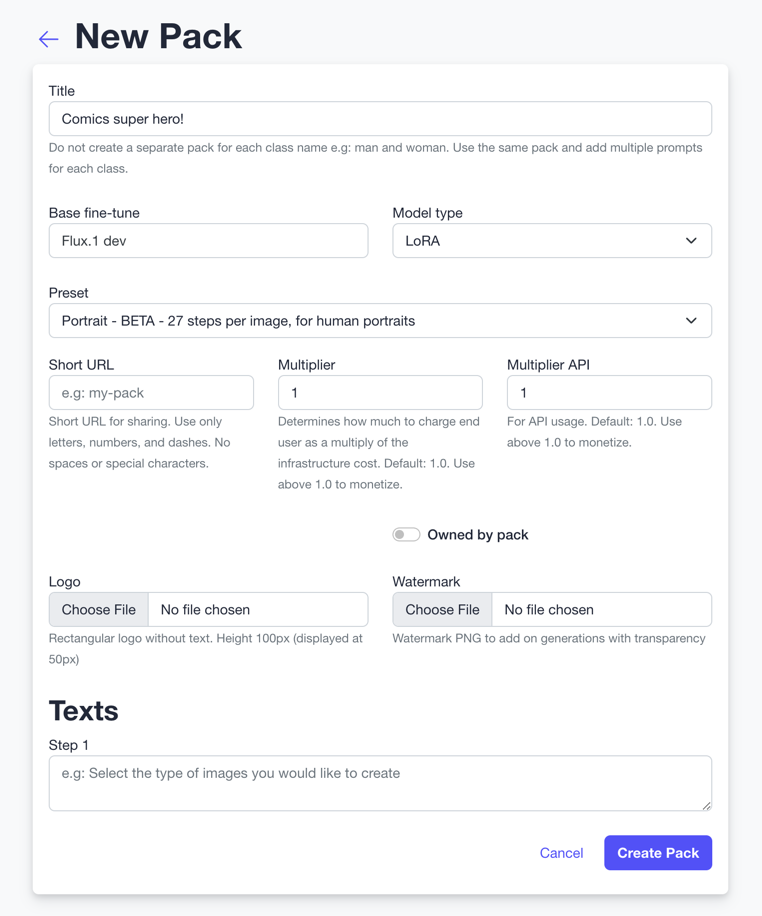
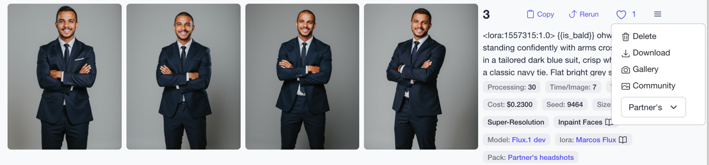

# The pack object

<iframe width="100%" height="500" src="https://www.youtube.com/embed/IUI6F5zVaAM?ab_channel=Astria_AI" title="How to fine tune explainer" frameborder="0" allow="accelerometer; autoplay; clipboard-write; encrypted-media; gyroscope; picture-in-picture" allowfullscreen />

A pack is a collection of prompts. A pack also contains the configuration for fine-tuning such as using LoRA/FaceID/Checkpoint, base model and preset.

:::info
The [headshot-starter](https://github.com/astriaai/headshots-starter?tab=readme-ov-file#incoming-changes) open-source project now supports packs.
:::

## Advantages
1. Test new prompts, ideas and themes on a bulk of models quickly to assure consistent high-quality results.
1. Move fast from the creative process of creating prompts to the deployment of new themes in production.
2. Avoid mismatch between hard-coded JSONs and the actual prompts.
3. Decouple the creative process from your code and avoid mirroring inference API details in your codebase.
3. Run user tests in production for new prompts and quickly iterate.
4. Aggregate likes for prompts to improve the quality of the generated images and tighten the feedback loop. 
5. Sort packs by aggregated likes to present the best packs to the user.

## Example user flow
1. `GET /packs` Display a list of packs to the user. See [docs](/docs/api/pack/list/)
2. User selects a pack, a class name (man/woman) and training images
3. User selects image to upload. Images are inspected using the [Image Inspect API](/docs/api/images/inspect/) to warn against bad quality images and detect characteristics of the training images for templating with `characteristics`.
4. Call `POST /p/:id/tunes` with title, (training) images, class name and `characteristics` - to create a new fine-tune model using a pack. See [docs](/docs/api/pack/tunes/create/)
5. `GET /tunes/:id/prompts` to get a list of prompts and their status
6. `POST /prompts/:id/likes` to send feedback to the API. See [docs](/docs/api/like/create/)
7. Sort prompts by likes
8. Present packs sorted by aggregated likes

## Tips
1. Packs should include multiple classes, like `man` and `woman` or `cat` and `dog`. Astria will use the relevant filters when a new tune is created according to the tune class
2. Pack cover image is taken from the last prompt added to the pack. If you'd like to change the pack cover image, you can do so by removing the last prompt from the pack and adding it again. The pack cover image will be updated to the last prompt added to the pack.

## Getting started
1. Click your email in the header to access [my packs](https://www.astria.ai/packs), and create your first pack. 
2. Assign prompts to the pack from the [prompts tab](https://www.astria.ai/prompts).
3. Once a pack is assigned a new tag shows next to the prompt indicating that it is assigned to the pack. 
