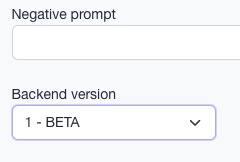

# Backend V1

Backend V1 is a complete rewrite of the original image inference and processing pipeline. Here are some of the improvements:

1. Hi-Res (aka Super-Resolution Details) for SDXL is available.
1. Faster.
1. Better handling of loading multiple LoRAs.
1. DPM++/Karras and DPM++SDE/Karras better results, especially with SDXL.
1. Civit results should be easy to reproduce.

Features still pending implementation for Backend V1:
1. TCD sampler
1. FaceID with --faceid_portrait
1. `--fix_bindi` 

:::info
As this is still in BETA stages, we encourage you to report any issues you may encounter using the support email.
:::

## Usage
You can find the "Backend version" dropdown in the **Advanced** settings of the prompt. Alternatively you may select the default account version for the account in the [user account setting](https://www.astria.ai/users/edit#profile) 

For API usage provide the `backend_version` attribute in the Prompt payload. See: [Create Prompt](/docs/api/prompt/create/#backend_version-optional) for more details.

