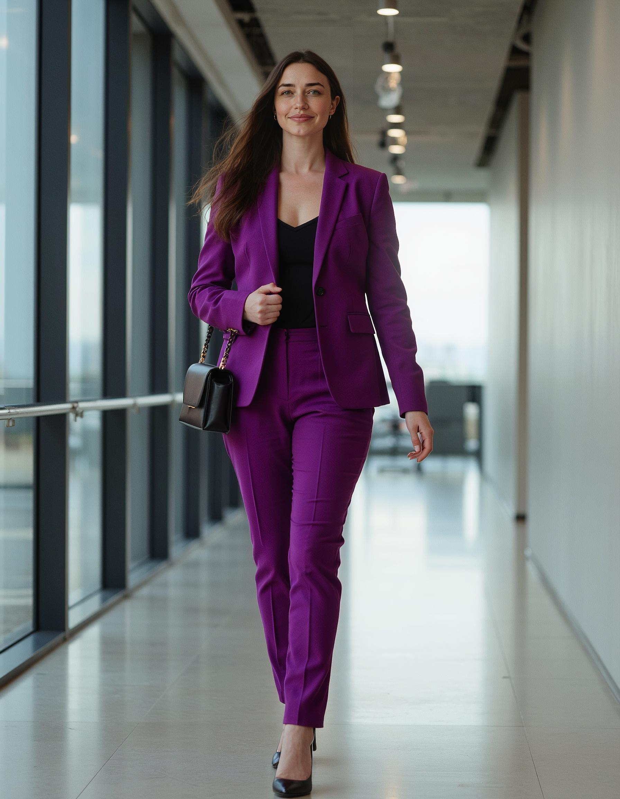

# Face Inpainting

## Overview
Face inpainting is a feature that maintains facial similarity mainly in long-shot and full-body generations by performing additional facial enhancement. When enabled, it automatically improves facial consistency regardless of the shot distance.


<div style={{ display: "grid", 'grid-template-columns': '1fr', gap: '1.5rem' }}>
<div>
<figcaption>Face Inpainting with Flux</figcaption>


</div>
</div>

<div style={{ display: "grid", 'grid-template-columns': '1fr 1fr', gap: '1.5rem' }}>
<div>
<figcaption>Zoom on face - Before</figcaption>


</div>
<div>
<figcaption>Zoom on face - After</figcaption>


</div>
</div>

<div style={{ display: "grid", 'grid-template-columns': '1fr 1fr', gap: '1.5rem' }}>
<div>
<figcaption>Full body longshot - before face inpainting</figcaption>



</div>
<div>
<figcaption>Full body longshot - after face inpainting</figcaption>


</div>
</div>

See examples in our [gallery](https://www.astria.ai/gallery?inpaint_faces=true)

## Enabling Face Inpainting

### Playground

 To enable face inpainting, open the ‘Advanced’ settings when generating an image, and click the Inpaint faces toggle. Notice that this will turn on the super resolution toggle as well, which is necessary for this feature.

### API
Use `inpaint_faces` and `super_resolution` in your prompt request.

#### Example Request

```bash
POST https://api.astria.ai/generate

{
  "prompt": "<lora:1795721:1.0> Surrounded by the natural beauty of a serene, wooded environment, the ohwx woman exudes a sense of tranquility and connection with her surroundings. She wears a flowing, organic-inspired dress in earthy tones, her face framed by loose, windblown hair. The lighting is soft and diffused, creating a soothing, meditative atmosphere that invites the viewer to pause and connect with the moment.",
  "num_images": 1,
  "super_resolution": true,
  "inpaint_faces": true,
  "w": 896,
  "h": 1152,
  "scheduler": "euler_a",
  "ar": "1:1"
}
```

## Notes

When face inpainting is enabled the following occurs:
- An additional inference cycle
- This affects the total cost per generation - see our [pricing page](https://www.astria.ai/pricing) for details
- Generation time will be a bit longer

Face inpainting Works with all Flux-based models, as well as SDXL and SD15


