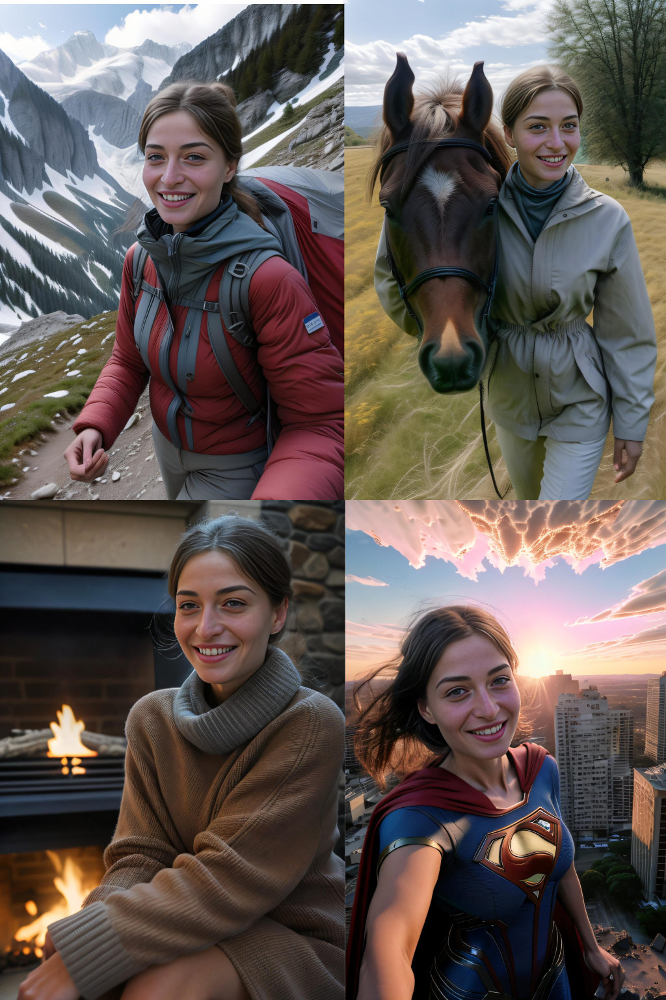

import Tabs from '@theme/Tabs';
import TabItem from '@theme/TabItem';


# FaceID
**BETA**

<div className="api-method">
<div>


<div style={{ display: "grid", 'grid-template-columns': '1fr 1fr', gap: '1.5rem' }}>
<div>
<figcaption>FaceID images</figcaption>


</div>

<div>
<figcaption>
<a href="https://www.astria.ai/gallery?text=faceid">Generations</a>
</figcaption>


</div>

</div>

See example prompts in the [gallery](https://www.astria.ai/gallery?text=faceid)

## Overview
FaceID is a model adapter allowing to generate image while preserving a person identity without fine-tuning. Input images can be as few as just one image.

## Usage
1. Generate a placeholder fine-tune dataset which will contain the person images. The fine-tune will not go through training and will be immediately ready.

2. Generate the image using the FaceID adapter using a syntax similar to LoRA - `<faceid:ID:1>` 

FaceID can work nicely together with [Face Swap](/docs/features/face-swap) to improve similarity.

</div>

<div>

### Step 1: Create fine-tune
#### POST /tunes

<Tabs groupId="lang">
  <TabItem value="curl" label="cURL" default>

```bash showLineNumbers
# With images as multipart/form-data
# Hard coded tune id of Realistic Vision v5.1 from the gallery - https://www.astria.ai/gallery/tunes 
# https://www.astria.ai/gallery/tunes/690204/prompts
curl -X POST -H "Authorization: Bearer $API_KEY" https://api.astria.ai/tunes \
          -F tune[title]="John Doe - UUID - 1234-6789-1234-56789" \
          -F tune[name]=man \
          -F tune[branch]="fast" \
          -F tune[model_type]="faceid" \
          -F tune[callback]="https://optional-callback-url.com/webhooks/astria?user_id=1&tune_id=1" \
          -F tune[base_tune_id]=690204 \
          -F "tune[images][]=@1.jpg" \
          -F "tune[images][]=@2.jpg" \
          -F "tune[images][]=@3.jpg" \
          -F "tune[images][]=@4.jpg"

# With image_urls as form-data
curl -X POST -H "Authorization: Bearer $API_KEY" https://api.astria.ai/tunes \
          -F tune[title]="John Doe - UUID - 1234-6789-1234-56789" \
          -F tune[name]=man \
          -F tune[branch]="fast" \
          -F tune[model_type]="faceid" \
          -F tune[callback]="https://optional-callback-url.com/to-your-service-when-ready?user_id=1&tune_id=1" \
          -F tune[base_tune_id]=690204 \
          -F "tune[image_urls][]=https://i.imgur.com/HLHBnl9.jpeg" \
          -F "tune[image_urls][]=https://i.imgur.com/HLHBnl9.jpeg" \
          -F "tune[image_urls][]=https://i.imgur.com/HLHBnl9.jpeg" \
          -F "tune[image_urls][]=https://i.imgur.com/HLHBnl9.jpeg"
          
# As JSON
cat > data.json <<- EOM
{
  "tune": {
    "title": "John Doe - UUID - 1234-6789-1234-56789",
    "name": "man",
    "branch": "fast",
    "model_type": "faceid",
    "callback": "https://optional-callback-url.com/to-your-service-when-ready?user_id=1&tune_id=1",
    "image_urls": [
      "https://i.imgur.com/HLHBnl9.jpeg",
      "https://i.imgur.com/HLHBnl9.jpeg",
      "https://i.imgur.com/HLHBnl9.jpeg",
      "https://i.imgur.com/HLHBnl9.jpeg"
    ]
  }
}
EOM

curl -X POST -H"Content-Type: application/json" -H "Authorization: Bearer $API_KEY" --data @data.json  https://api.astria.ai/tunes          
```
  </TabItem>
  <TabItem value="javascript" label="Node.js">

```javascript
// NodeJS 16
// With image_urls and fetch()
import fetch from "node-fetch";

const API_KEY = 'sd_XXXXXX';
const DOMAIN = 'https://api.astria.ai';

function createTune() {
  let options = {
    method: 'POST',
    headers: { 'Authorization': 'Bearer ' + API_KEY, 'Content-Type': 'application/json' },
    body: JSON.stringify({
      tune: {
        "title": 'John Doe - UUID - 1234-6789-1234-56789',
        // Hard coded tune id of Realistic Vision v5.1 from the gallery - https://www.astria.ai/gallery/tunes 
        // https://www.astria.ai/gallery/tunes/690204/prompts
        "base_tune_id": 690204,
        "name": "man",
        "branch": "fast",
        "model_type": "faceid",
        "image_urls": [
          "https://i.imgur.com/HLHBnl9.jpeg",
          "https://i.imgur.com/HLHBnl9.jpeg",
          "https://i.imgur.com/HLHBnl9.jpeg",
          "https://i.imgur.com/HLHBnl9.jpeg"
        ]
      }
    })
  };
  return fetch(DOMAIN + '/tunes', options)
    .then(r => r.json())
    .then(r => console.log(r))
}

createTune()


/// With form-data, fetch()
import FormData from 'form-data';
import fs from 'fs';
import fetch from "node-fetch";

const API_KEY = 'sd_XXXX';
const DOMAIN = 'https://api.astria.ai';
function createTune() {
  let formData = new FormData();
  formData.append('tune[title]', 'John Doe - UUID - 1234-6789-1234-56789');
  formData.append('tune[branch]', 'fast');
  formData.append('tune[model_type]', 'faceid');
  // Hard coded tune id of Realistic Vision v5.1 from the gallery - https://www.astria.ai/gallery/tunes 
  // https://www.astria.ai/gallery/tunes/690204/prompts
  formData.append('tune[base_tune_id]', 690204);
  formData.append('tune[name]', 'man');
  // Load all JPGs from ./samples directory and append to FormData
  let files = fs.readdirSync('./samples');
  files.forEach(file => {
    if(file.endsWith('.jpg')) {
      formData.append('tune[images][]', fs.createReadStream(`./samples/${file}`), file);
    }
  });
  formData.append('tune[callback]', 'https://optional-callback-url.com/to-your-service-when-ready?user_id=1&tune_id=1');

  let options = {
    method: 'POST',
    headers: {
      'Authorization': 'Bearer ' + API_KEY
    },
    body: formData
  };
  return fetch(DOMAIN + '/tunes', options)
    .then(r => r.json())
    .then(r => console.log(r));
}

createTune();

```
  </TabItem>
  <TabItem value="python" label="Python">

```python
import requests
headers = {'Authorization': f'Bearer {API_KEY}'}

def load_image(file_path):
  with open(file_path, "rb") as f:
    return f.read()

# Assuming `tune.images` are already defined in your context
# If not, you should define them before the below code

image_data = load_image("assets/image.jpeg")

data = {
  "tune[title]": "John Doe - UUID - 1234-6789-1234-56789",
  "tune[name]": "man",
  "tune[base_tune_id]": 690204,
  "tune[branch]": "fast",
  "tune[token]": "ohwx"
}
files = []

for image in tune.images:
  image_data = load_image(image)  # Assuming image is a file path
  files.append(("tune[images][]", image_data))

API_URL = 'https://api.astria.ai/tunes'
response = requests.post(API_URL, data=data, files=files, headers=headers)
response.raise_for_status()

```
  </TabItem>
</Tabs>

#### Response

```json

[
  {
    "id": 1,
    "title": "John Doe",
    "name": "woman",
    "token": "ohwx",
    "base_tune_id": null,
    "args": null,
    "steps": null,
    "face_crop": null,
    "training_face_correct": false,
    "ckpt_url": "https://sdbooth2-production.s3.amazonaws.com/mock",
    "ckpt_urls": [
      "https://sdbooth2-production.s3.amazonaws.com/mock"
    ],
    "eta": "2023-10-02T14:32:40.363Z",
    "trained_at": "2023-10-02T14:32:40.363Z",
    "started_training_at": "2023-10-02T14:32:05.229Z",
    "expires_at": "2023-11-01T14:32:40.363Z",
    "created_at": "2023-10-02T14:32:05.067Z",
    "branch": "sd15",
    "model_type": "faceid",
    "updated_at": "2023-10-02T14:32:40.363Z",
    "url": "https://www.astria.ai/tunes/788416.json",
    "orig_images": [
      "https://sdbooth2-production.s3.amazonaws.com/mock",
      "https://sdbooth2-production.s3.amazonaws.com/mock",
      "https://sdbooth2-production.s3.amazonaws.com/mock",
      "https://sdbooth2-production.s3.amazonaws.com/mock",
      "https://sdbooth2-production.s3.amazonaws.com/mock",
      "https://sdbooth2-production.s3.amazonaws.com/mock",
      "https://sdbooth2-production.s3.amazonaws.com/mock",
      "https://sdbooth2-production.s3.amazonaws.com/mock",
      "https://sdbooth2-production.s3.amazonaws.com/mock",
      "https://sdbooth2-production.s3.amazonaws.com/mock"
    ]
  },
  {
    "id": 775459,
    "title": "Marry Jane",
    "name": null,
    "is_api": false,
    "token": "ohwx",
    "base_tune_id": null,
    "args": null,
    "steps": null,
    "face_crop": null,
    "training_face_correct": null,
    "ckpt_url": "https://sdbooth2-production.s3.amazonaws.com/mock",
    "ckpt_urls": [
      "https://sdbooth2-production.s3.amazonaws.com/mock"
    ],
    "eta": "2023-09-23T16:07:49.137Z",
    "trained_at": "2023-09-23T16:07:49.137Z",
    "started_training_at": "2023-09-23T16:07:37.334Z",
    "expires_at": "2023-10-23T16:07:49.137Z",
    "created_at": "2023-09-23T16:07:36.606Z",
    "branch": "sd15",
    "model_type": "faceid",
    "updated_at": "2023-09-23T16:07:49.138Z",
    "url": "https://www.astria.ai/tunes/775459.json",
    "orig_images": [
      "https://sdbooth2-production.s3.amazonaws.com/mock",
      "https://sdbooth2-production.s3.amazonaws.com/mock",
      "https://sdbooth2-production.s3.amazonaws.com/mock",
      "https://sdbooth2-production.s3.amazonaws.com/mock",
      "https://sdbooth2-production.s3.amazonaws.com/mock",
      "https://sdbooth2-production.s3.amazonaws.com/mock",
      "https://sdbooth2-production.s3.amazonaws.com/mock",
      "https://sdbooth2-production.s3.amazonaws.com/mock",
      "https://sdbooth2-production.s3.amazonaws.com/mock"
    ]
  }
 ]
```


### Step 2: Create prompts

#### POST /tunes/:id/prompts

<Tabs groupId="lang">
  <TabItem value="curl" label="cURL" default>

```bash showLineNumbers
# Note the hard-coded 690204 which is the tune_id of Realistic Vision v5.1 from the gallery
curl -X POST -H "Authorization: Bearer $API_KEY" https://api.astria.ai/tunes/690204/prompts \
          -F prompt[text]="<faceid:tune_id:strength> woman trekking in the alps" \
          -F prompt[negative_prompt]="" \
          -F prompt[super_resolution]=true \
          -F prompt[face_correct]=true \
          -F prompt[face_swap]=true \
          -F prompt[callback]="https://optional-callback-url.com/to-your-service-when-ready?prompt_id=1" 
```
  </TabItem>
  <TabItem value="javascript" label="Node.js">

```javascript
const fetch = require('node-fetch');
const FormData = require('form-data');

// Note the hard-coded 690204 which is the tune_id of Realistic Vision v5.1 from the gallery
const API_URL = 'https://api.astria.ai/tunes/690204/prompts';
const API_KEY = 'YOUR_API_KEY'; // Replace with your actual API key
const headers = { Authorization: `Bearer ${API_KEY}` }

const form = new FormData();
form.append('prompt[text]', '<faceid:tune_id:strength> woman trekking in the alps');
form.append('prompt[negative_prompt]', '');
form.append('prompt[super_resolution]', true);
form.append('prompt[face_correct]', true);
form.append('prompt[face_swap]', true);
form.append('prompt[callback]', 'https://optional-callback-url.com/to-your-service-when-ready?prompt_id=1');

fetch(API_URL, {
  method: 'POST',
  headers: headers,
  body: form
}).then(response => response.json())


```
  </TabItem>
  <TabItem value="python" label="Python">

```python
import requests

# Note the hard-coded 690204 which is the tune_id of Realistic Vision v5.1 from the gallery
API_URL = 'https://api.astria.ai/tunes/690204/prompts'
API_KEY = 'YOUR_API_KEY'  # Replace with your actual API key

headers = {
    'Authorization': f'Bearer {API_KEY}'
}

data = {
  'prompt[text]': '<faceid:tune_id:strength> woman trekking in the alps',
  'prompt[negative_prompt]': '',
  'prompt[super_resolution]': True,
  'prompt[face_correct]': True,
  'prompt[face_swap]': True,
  'prompt[callback]': 'https://optional-callback-url.com/to-your-service-when-ready?prompt_id=1'
}
files = []
files.append((f"tune[prompts_attributes][{i}][input_image]", load_image(prompt['input_image'])))

response = requests.post(API_URL, headers=headers, data=data)
```
  </TabItem>
</Tabs>

</div>
</div>
