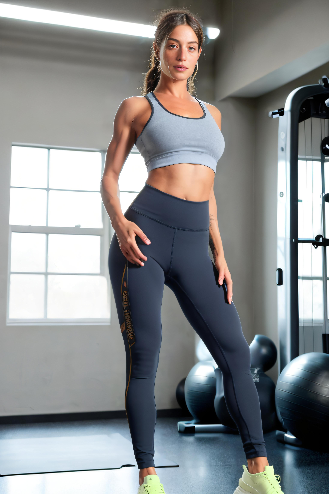
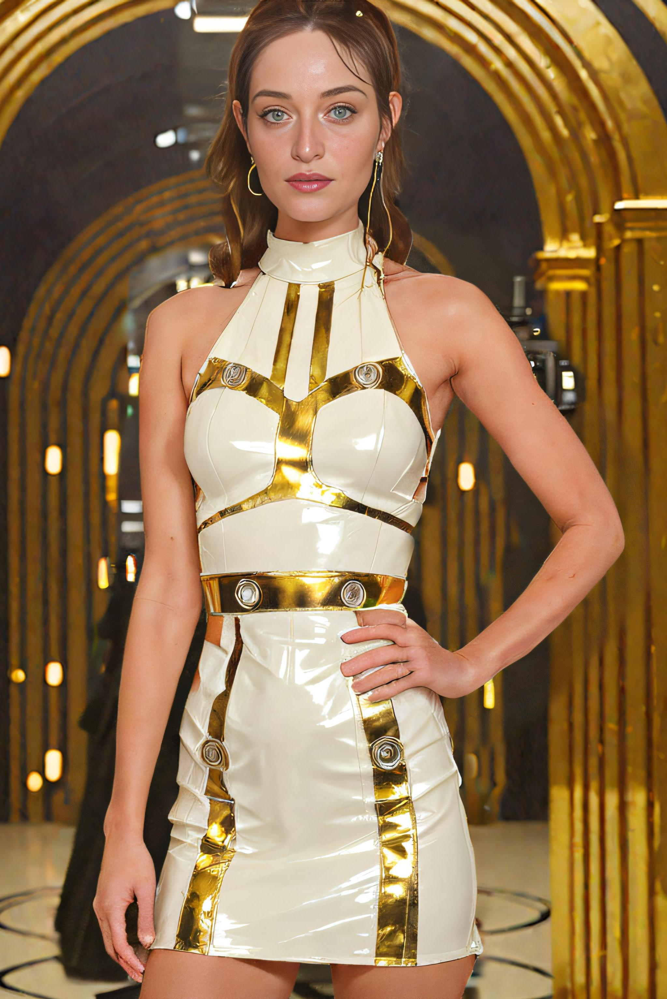

# Multi-Pass inference
**BETA**

<div style={{ display: "grid", 'grid-template-columns': '1fr 1fr 1fr 1fr', gap: '1.5rem' }}>
<div>
<figcaption>Gym</figcaption>


</div>

<div>
<figcaption>Hiking</figcaption>


</div>

<div>
<figcaption>Posh</figcaption>


</div>

<div>
<figcaption>Swimsuit</figcaption>


</div>

<div>
<figcaption>Fashion</figcaption>


</div>

<div>
<figcaption>Starwars</figcaption>


</div>

<div>
<figcaption>Mech-warrior</figcaption>


</div>

<div>
<figcaption>Dreamy</figcaption>


</div>


</div>

The prompt is divided by the `BREAK` keyword such as:
* 1st **base prompt** used to generate the background and scene. 
* 2nd **common prompt** that's concatenated to each person prompt and the base prompt to avoid repetition.
* 3rd **person prompt** Describe what the person is wearing or holding


The advantages of using multi-pass inference are:
* Base prompt first pass allows to use the full breadth of an unmodified model. As such image compositions, fabrics and textures and details will show much better.
* Separating the person from the background allows to prompt in more details on clothing, accessories and colors.
* Better similarity to the original subject.

See [pricing](https://www.astria.ai/pricing) for the cost of this feature.

## Example prompt

```text
realistic digital painting, astronaut in a garden on a spring day, by martine johanna and simon stalenhag and chie yoshii and casey weldon and wlop, ornate, dynamic, particulate, rich colors, intricate, elegant, highly detailed, harpers bazaar art, fashion magazine, smooth, sharp focus, 8 k, octane rende --mask_prompt foreground --mask_negative clothes --mask_invert --mask_dilate -20 --hires_denoising_strength 0.2
num_images=1
negative_prompt=clay, text, watermark, padding, cropped, typography
seed=
steps=30
cfg_scale=
controlnet=pose
input_image_url=https://sdbooth2-production.s3.amazonaws.com/d6ff3soq5pok5tlbcanf599vkw06
mask_image_url=
denoising_strength=
controlnet_conditioning_scale=
controlnet_txt2img=false
super_resolution=true
inpaint_faces=false
face_correct=true
film_grain=false
face_swap=false
hires_fix=true
prompt_expansion=false
ar=1:1
scheduler=dpm++sde_karras
color_grading=
use_lpw=true
w=
h=
```
