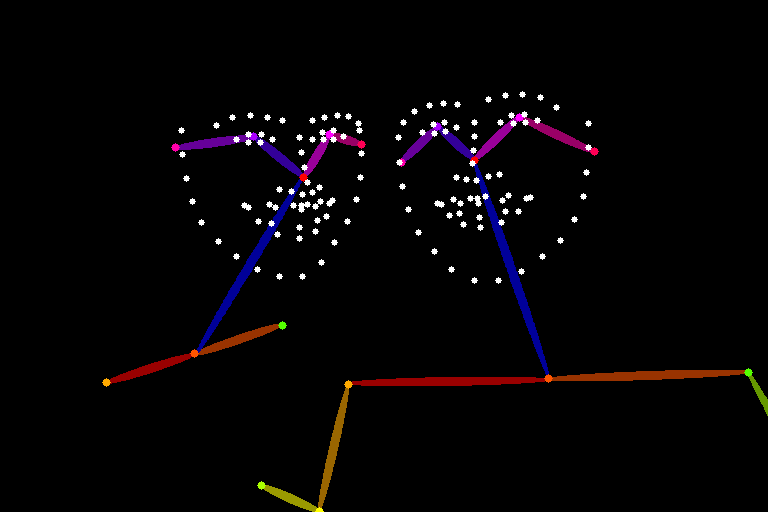

# Multi-Person inference 
**BETA**

<div style={{ display: "grid", 'grid-template-columns': '1fr 1fr', gap: '1.5rem' }}>
<div>
<figcaption>Multiperson pose input image</figcaption>


</div>

<div>
<figcaption>Multiperson result</figcaption>


</div>

</div>

## Overview
Multi-person inference is a feature that allows you to generate images with multiple people in them.
You can see some of the examples in the [gallery](https://www.astria.ai/gallery?is_multiperson=true) or in the [community feed](https://www.astria.ai/community?is_multiperson=true).

See [pricing](https://www.astria.ai/pricing) for the cost of this feature.

## Requirements
LoRA (`model_type=lora` in the [create tune](/docs/api/tune/create) API) is required.
Moreover, it's recommended to use SD15 models based on [RealisticVision V5.1](https://www.astria.ai/gallery/tunes/690204/prompts) as SD15 works better than SDXL for this use-case.

## Step 1: Training
[Create a fine-tune](https://www.astria.ai/tunes/new) for each person with `model_type=lora`


# Step 2 - Inference
Provide an `input_image` and `controlnet=pose` so that the generation has a solid image composition to start with.
If no `input_image` is given, a constant pose input image (with arms crossed) will be used for each person.

The prompt is divided by the `BREAK` keyword such as:
* 1st **base prompt** used to generate the background and scene.
* 2nd **common prompt** that's concatenated to each person prompt and the base prompt to avoid repetition.
* 3+ each person and its LoRA reference.

Example prompt for multi-person inference

```text
Glamour aristocrat party 2girl BREAK Zeiss Canon Mark D5, wallpaper, photorealistic, detailed skin BREAK (ohwx woman) <lora:849330:1> BREAK (ohwx woman) <lora:861629:1> num_images=1 negative_prompt=hat, open mouth, text, oversaturated, ugly, 3d, render, cartoon, grain, low-res, kitsch ugly, tiling, poorly drawn hands, poorly drawn feet, poorly drawn face, out of frame, mutation, mutated, extra limbs, extra legs, extra arms, disfigured, deformed, cross-eye, body out of shot 
seed= 
steps= 
cfg_scale= 
controlnet=pose 
input_image_url=https://sdbooth2-production.s3.amazonaws.com/2vxpjloxggnv9s4tw33ckn5xzdnp 
mask_image_url= 
denoising_strength= 
controlnet_conditioning_scale= 
controlnet_txt2img=true 
super_resolution=true 
inpaint_faces=true 
face_correct=false
film_grain=true
face_swap=true
hires_fix=true
prompt_expansion=false
ar=1:1
scheduler=dpm++sde_karras
color_grading=
use_lpw=true
w=768
h=512
```

