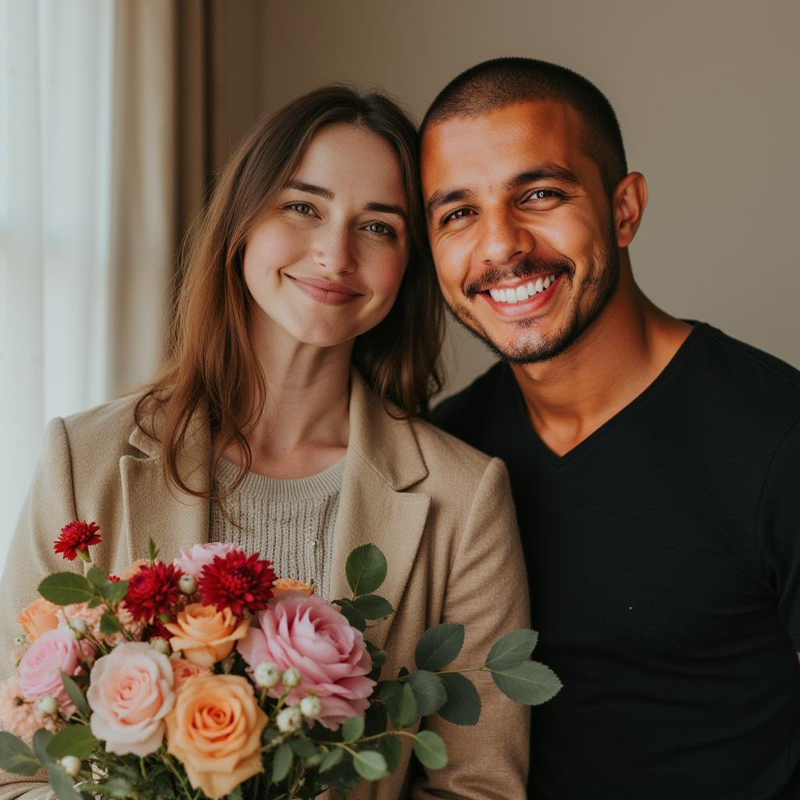
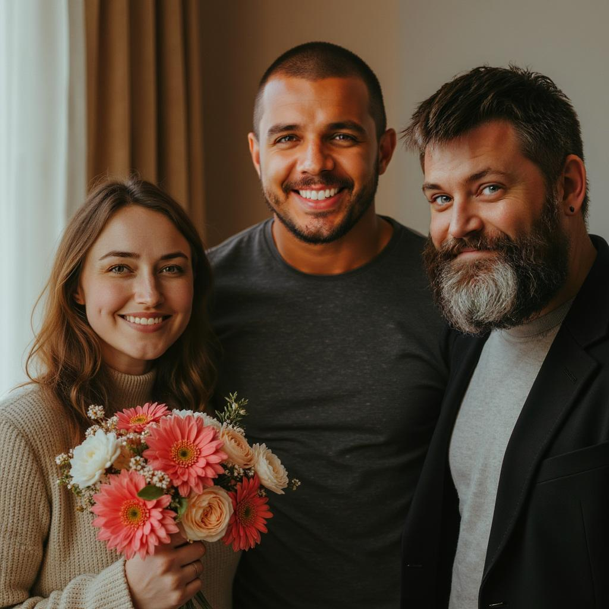

# Multi-LoRA / Multi-Person for Flux 
**BETA**

<figcaption>2 people</figcaption>

<figcaption>3 people</figcaption>

<figcaption>4 people</figcaption>

See example prompts in the [gallery](https://www.astria.ai/gallery?branch=flux1&text=--multi)

## Overview
Multi-person inference is a feature that allows you to generate images with multiple people in them.
See example prompts in the [gallery](https://www.astria.ai/gallery?is_multiperson=true&branch=flux1).

See [pricing](https://www.astria.ai/pricing) for the cost of this feature.

### Step 1: Training
[Create a fine-tune](https://www.astria.ai/tunes/new) for each person. Models should be based on Flux1.dev and model type LoRA.

### Step 2 - Inference
Write a simple prompt which references each LoRA and the trigger token and class name.

