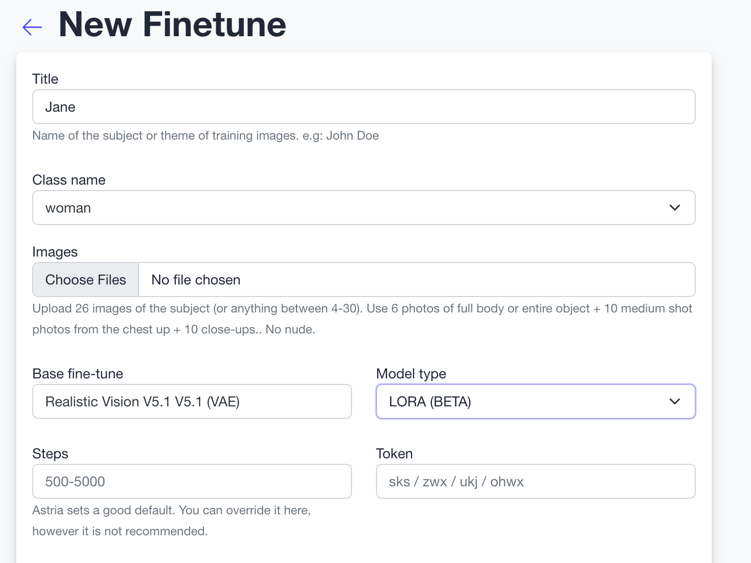
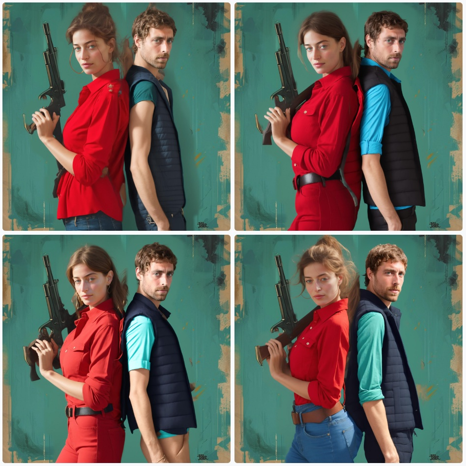

# Multi-Person inference 
**BETA**

<div style={{ display: "grid", 'grid-template-columns': '1fr 1fr', gap: '1.5rem' }}>
<div>
<figcaption>Multiperson result</figcaption>


</div>

</div>

See example prompts in the [gallery](https://www.astria.ai/gallery?is_multiperson=true&branch=flux1)

## Overview
Multi-person inference is a feature that allows you to generate images with multiple people in them.
See example prompts in the [gallery](https://www.astria.ai/gallery?is_multiperson=true&branch=flux1) or in the [community feed](https://www.astria.ai/community?is_multiperson=true&branch=flux1).

See [pricing](https://www.astria.ai/pricing) for the cost of this feature.

### Step 1: Training
[Create a fine-tune](https://www.astria.ai/tunes/new) for each person. Model can be either lora or a checkpoint.



### Step 2 - Inference
Provide an `input_image` and `controlnet=pose` so that the generation has a solid image composition to start with.
If no `input_image` is given, a constant pose input image (with arms crossed) will be used for each person.

The prompt is divided by the `BREAK` keyword such as:
* 1st **base prompt** used to generate the background and scene.
* 2nd **common prompt** that's concatenated to each person prompt and the base prompt to avoid repetition.
* 3+ each person and its LoRA syntax reference (even for checkpoint)

## Examples

### 1. Without an input image

<div style={{ display: "grid", 'grid-template-columns': '0.5fr 1fr', gap: '1.5rem' }}>

<div>
<figcaption>Multiperson result</figcaption>


</div>

</div>

```text
Dramatic 1940s film noir scene. Couple standing together aiming guns, wooden paneled background.
BREAK
BREAK <lora:1533312:1.0> ohwx woman with determined expression, retro updo hairstyle, bright red lipstick, black and yellow color-blocked dress, aiming revolver with right hand
BREAK <lora:1558021:1.0> ohwx man with serious face, grey fedora hat, brown suit with patterned tie, white shirt, aiming pistol with left hand
num_images=4
negative_prompt=
seed=
steps=
cfg_scale=
controlnet=
input_image_url=
mask_image_url=
denoising_strength=
controlnet_conditioning_scale=
controlnet_txt2img=false
super_resolution=false
inpaint_faces=false
face_correct=false
film_grain=false
face_swap=false
hires_fix=false
backend_version=1
ar=1:1
scheduler=euler_a
color_grading=
use_lpw=false
w=1024
h=576
```

### 3. Prompt with input image as a background
In some cases it might be desired to keep the exact same background as the input image, and only change the people in the image. To do this, add an `input_image` and keep the base prompt empty, i.e: start the prompt with `BREAK BREAK` to keep both the base and common prompts empty.

<div style={{ display: "grid", 'grid-template-columns': '0.5fr 1fr', gap: '1.5rem' }}>
<div>
<figcaption>Pose input image</figcaption>


</div>

<div>
<figcaption>Multiperson result</figcaption>



</div>

</div>

```text
BREAK 
BREAK ohwx woman, red blouse jeans, and belt, holding a rifle <lora:749152:1>
BREAK ohwx man, dark vest <lora:749183:1>
num_images=4
negative_prompt=
seed=43
steps=30
cfg_scale=
controlnet=
input_image_url=https://sdbooth2-production.s3.amazonaws.com/4j0pej570oosmbj22xx6igf3gfi2
mask_image_url=
denoising_strength=
controlnet_conditioning_scale=
controlnet_txt2img=false
super_resolution=true
inpaint_faces=true
face_correct=false
film_grain=false
face_swap=true
hires_fix=true
ar=1:1
scheduler=dpm++sde_karras
color_grading=
use_lpw=true
w=
h=
```

