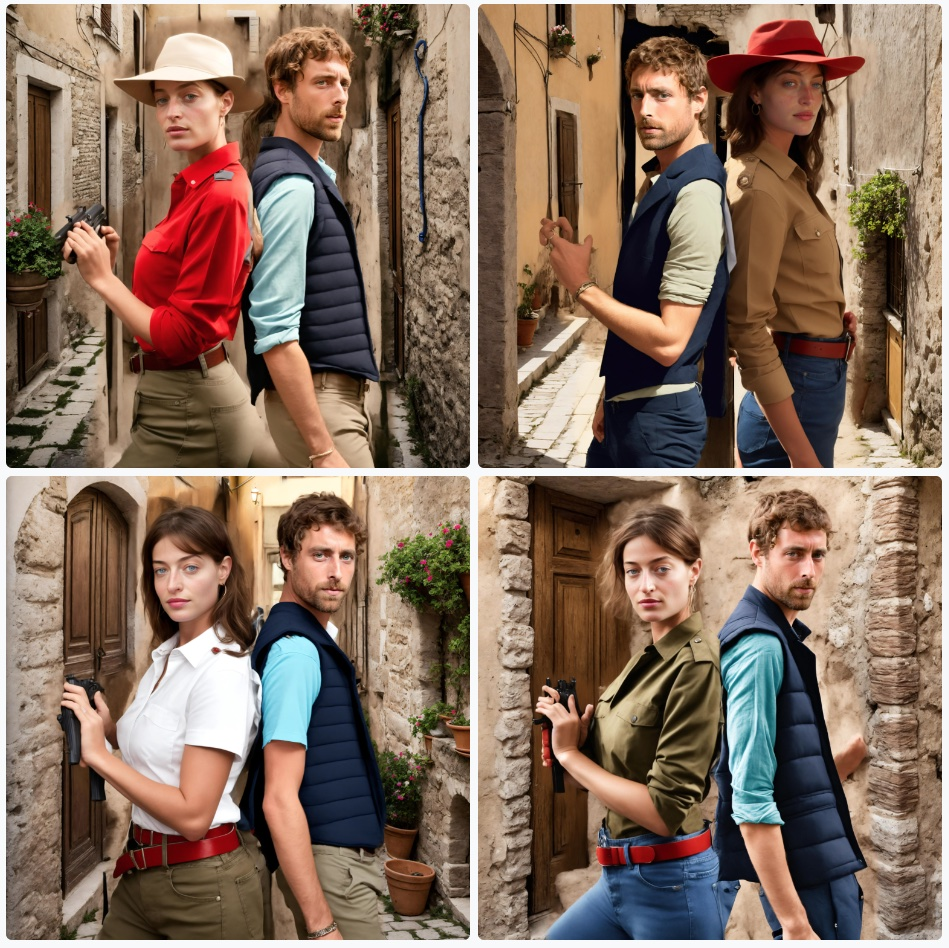

# Multi-Person inference 
**BETA**

<div style={{ display: "grid", 'grid-template-columns': '1fr 1fr', gap: '1.5rem' }}>
<div>
<figcaption>Multiperson pose input image</figcaption>


</div>

<div>
<figcaption>Multiperson result</figcaption>


</div>

</div>

See example prompts in the [gallery](https://astria.ai/gallery?is_multiperson=true)

## Overview
Multi-person inference is a feature that allows you to generate images with multiple people in them.
See example prompts in the [gallery](https://www.astria.ai/gallery?is_multiperson=true) or in the [community feed](https://www.astria.ai/community?is_multiperson=true).

See [pricing](https://www.astria.ai/pricing) for the cost of this feature.

## Requirements
It is recommended to use SD15 models based on [RealisticVision V5.1](https://www.astria.ai/gallery/tunes/690204/prompts) as SD15 works better than SDXL for this use-case.

### Step 1: Training
[Create a fine-tune](https://www.astria.ai/tunes/new) for each person. Model can be either lora or a checkpoint.


### Step 2 - Inference
Provide an `input_image` and `controlnet=pose` so that the generation has a solid image composition to start with.
If no `input_image` is given, a constant pose input image (with arms crossed) will be used for each person.

The prompt is divided by the `BREAK` keyword such as:
* 1st **base prompt** used to generate the background and scene.
* 2nd **common prompt** that's concatenated to each person prompt and the base prompt to avoid repetition.
* 3+ each person and its LoRA syntax reference (even for checkpoint)

## Examples

### 1. Pre-processed controlnet txt2img pose input image

<div style={{ display: "grid", 'grid-template-columns': '0.5fr 1fr', gap: '1.5rem' }}>
<div>
<figcaption>Pose input image</figcaption>


</div>

<div>
<figcaption>Multiperson result</figcaption>


</div>

</div>

```text
Glamour aristocrat party 2girl 
BREAK Zeiss Canon Mark D5, wallpaper, photorealistic, detailed skin 
BREAK (ohwx woman) <lora:849330:1> BREAK (ohwx woman) <lora:861629:1> 
num_images=1 
negative_prompt=hat, open mouth, text, oversaturated, ugly, 3d, render, cartoon, grain, low-res, kitsch ugly, tiling, poorly drawn hands, poorly drawn feet, poorly drawn face, out of frame, mutation, mutated, extra limbs, extra legs, extra arms, disfigured, deformed, cross-eye, body out of shot 
seed= 
steps= 
cfg_scale= 
controlnet=pose 
input_image_url=https://sdbooth2-production.s3.amazonaws.com/2vxpjloxggnv9s4tw33ckn5xzdnp 
mask_image_url= 
denoising_strength= 
controlnet_conditioning_scale= 
controlnet_txt2img=true 
super_resolution=true 
inpaint_faces=true 
face_correct=false
film_grain=true
face_swap=true
hires_fix=true
ar=1:1
scheduler=dpm++sde_karras
color_grading=
use_lpw=true
w=768
h=512
```

### 2. Pose input image txt2img
To use an input image for the pose, while preserving the semantics of the input image, use an input image with `controlnet_txt2img=True` and `controlnet=pose`

<div style={{ display: "grid", 'grid-template-columns': '0.5fr 1fr', gap: '1.5rem' }}>
<div>
<figcaption>Pose input image</figcaption>


</div>

<div>
<figcaption>Multiperson result</figcaption>



</div>

</div>

```text
A beautiful man and woman in an Italian village 
BREAK 
BREAK ohwx woman, red blouse jeans, and belt, holding a rifle <lora:749152:1>
BREAK ohwx man, dark vest <lora:749183:1>
num_images=4
negative_prompt=
seed=43
steps=30
cfg_scale=
controlnet=pose
input_image_url=https://sdbooth2-production.s3.amazonaws.com/2ftedv374nggsabon14nqvuqyzsc
mask_image_url=
denoising_strength=
controlnet_conditioning_scale=
controlnet_txt2img=true
super_resolution=true
inpaint_faces=true
face_correct=false
film_grain=false
face_swap=true
hires_fix=true
ar=1:1
scheduler=dpm++sde_karras
color_grading=
use_lpw=true
w=
h=
```

### 3. Prompt with input image as a background
In some cases it might be desired to keep the exact same background as the input image, and only change the people in the image. To do this, add an `input_image` and keep the base prompt empty, i.e: start the prompt with `BREAK BREAK` to keep both the base and common prompts empty.

<div style={{ display: "grid", 'grid-template-columns': '0.5fr 1fr', gap: '1.5rem' }}>
<div>
<figcaption>Pose input image</figcaption>


</div>

<div>
<figcaption>Multiperson result</figcaption>


</div>

</div>

```text
BREAK 
BREAK ohwx woman, red blouse jeans, and belt, holding a rifle <lora:749152:1>
BREAK ohwx man, dark vest <lora:749183:1>
num_images=4
negative_prompt=
seed=43
steps=30
cfg_scale=
controlnet=
input_image_url=https://sdbooth2-production.s3.amazonaws.com/4j0pej570oosmbj22xx6igf3gfi2
mask_image_url=
denoising_strength=
controlnet_conditioning_scale=
controlnet_txt2img=false
super_resolution=true
inpaint_faces=true
face_correct=false
film_grain=false
face_swap=true
hires_fix=true
ar=1:1
scheduler=dpm++sde_karras
color_grading=
use_lpw=true
w=
h=
```


### 4. No input image
The base prompt will be used to generate the background and scene. This method is more prone to variation and results can be less consistent.

<div style={{ display: "grid", 'grid-template-columns': '1fr', gap: '1.5rem' }}>

<div>
<figcaption>Multiperson result</figcaption>


</div>

</div>

```text
A beautiful man and woman in an Italian village 
BREAK 
BREAK ohwx woman, red blouse jeans, and belt, holding a rifle <lora:749152:1>
BREAK ohwx man, dark vest <lora:749183:1>
num_images=4
negative_prompt=
seed=43
steps=30
cfg_scale=
controlnet=
input_image_url=
mask_image_url=
denoising_strength=
controlnet_conditioning_scale=
controlnet_txt2img=true
super_resolution=true
inpaint_faces=true
face_correct=false
film_grain=false
face_swap=true
hires_fix=true
ar=1:1
scheduler=dpm++sde_karras
color_grading=
use_lpw=true
w=512
h=640
```


### 5. DALLE background image
Prefix the base prompt with `DALLE: ` to use OpenAI [DALLE3](https://openai.com/dall-e-3) to generate the background and scene.
Only the 

<div style={{ display: "grid", 'grid-template-columns': '1fr', gap: '1.5rem' }}>

<div>
<figcaption>Multiperson with DALLE background image </figcaption>


</div>

</div>

```text
DALLE: A portrait of a couple in a small Italian village
BREAK
BREAK ohwx woman, red blouse jeans, and belt, holding a rifle <lora:749152:1>
BREAK ohwx man, dark vest <lora:749183:1>
num_images=4
negative_prompt=
seed=43
steps=30
cfg_scale=
controlnet=
input_image_url=
mask_image_url=
denoising_strength=
controlnet_conditioning_scale=
controlnet_txt2img=false
super_resolution=true
inpaint_faces=true
face_correct=false
film_grain=false
face_swap=true
hires_fix=true
ar=1:1
scheduler=dpm++sde_karras
color_grading=
use_lpw=true
w=512
h=640
```

### 6. Img2img
**Not recommended**. When not specifying a controlnet pose/depth to use, the model is having hard time creating multi person results and the quality is not consistent.

<div style={{ display: "grid", 'grid-template-columns': '0.5fr 1fr', gap: '1.5rem' }}>
<div>
<figcaption>Pose input image</figcaption>


</div>

<div>
<figcaption>Multiperson result</figcaption>


</div>

</div>

```text
A beautiful man and woman in an Italian village 
BREAK 
BREAK ohwx woman, red blouse jeans, and belt, holding a rifle <lora:749152:1>
BREAK ohwx man, dark vest <lora:749183:1>
num_images=4
negative_prompt=
seed=43
steps=30
cfg_scale=
controlnet=
input_image_url=https://sdbooth2-production.s3.amazonaws.com/3moqd5vab7j68iuozpsnx8m7mxil
mask_image_url=
denoising_strength=
controlnet_conditioning_scale=
controlnet_txt2img=true
super_resolution=true
inpaint_faces=true
face_correct=false
film_grain=false
face_swap=true
hires_fix=true
ar=1:1
scheduler=dpm++sde_karras
color_grading=
use_lpw=true
w=
h=
```

