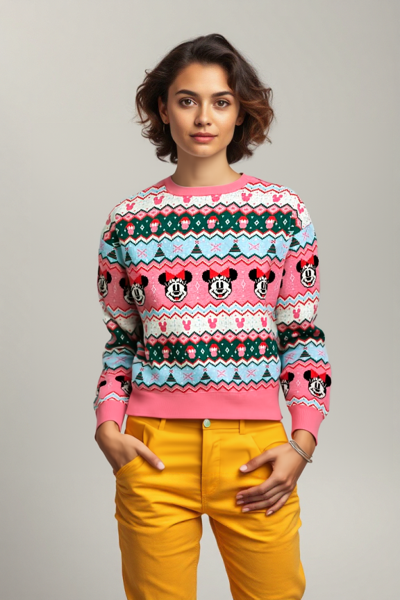
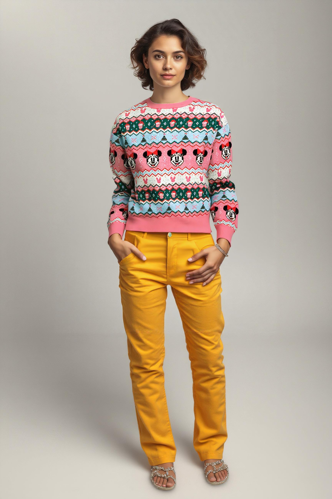

import Tabs from '@theme/Tabs';
import TabItem from '@theme/TabItem';

# Outpainting
** For flux **

### Outpainting only
<div style={{ display: "grid", 'grid-template-columns': '1fr 1fr', gap: '1.5rem' }}>
<div>
<figcaption>Input</figcaption>


</div>

<div>
<figcaption>Outpainting only - no txt2img</figcaption>


</div>

</div>

### txt2img + Outpainting
<div style={{ display: "grid", 'grid-template-columns': '1fr 1fr', gap: '1.5rem' }}>
<div>
<figcaption>Txt2img only 1:1 (1024x1024)</figcaption>


</div>

<div>
<figcaption>txt2img + outpaint to 9:16</figcaption>


</div>

</div>

<div style={{ display: "grid", 'grid-template-columns': '1fr 1fr', gap: '1.5rem' }}>
<div>
<figcaption>txt2img + outpaint 16:9</figcaption>


</div>

<div>
<figcaption>txt2img + outpaint 16:9</figcaption>


</div>

</div>

See outpaint examples in the [gallery](https://www.astria.ai/gallery?text=outpaint)

## Overview
Outpainting is a technique used to extend an image to bring in more context and background into the initally generated subject of the image. Examples for usage could be taking a 1:1 aspect-ratio (1024x1024) and extending it into a 16:9 cinematic view, or taking a waist up portrait 1:1 and extending it into a full body portrait 9:16. One of the advantages of this is better preservation of the face identity, as well as the ability of the model on focusing on the background generation due to it being separated into a separate task.

See [pricing](https://www.astria.ai/pricing) for the cost of this feature.


<div className="api-method">
<div>


## Usage
Below are the arguments that should be added at the end of the prompt text to enable outpainting:

1. `--outpaint` - The anchor for outpainting. Options: `top-left, top-right, bottom-left, bottom-right, center, top-center, bottom-center, left-center, right-center`
1. `--outpaint_height` 
1. `--outpaint_width`  
1. `--outpaint_prompt` - Optional

In case you're interested in setting an input image and doing only outpainting, and skipping the txt2img/img2img step, make sure to set `denoising_strength: 0`

## Examples
Outpaint only

```text
--outpaint top-center --outpaint_width 864 --outpaint_height 1296
num_images=1
negative_prompt=
seed=
steps=
cfg_scale=
controlnet=
input_image_url=https://sdbooth2-production.s3.amazonaws.com/qg202t8sqfn1olewuzdujgaq29si
mask_image_url=
denoising_strength=0
controlnet_conditioning_scale=
controlnet_txt2img=false
super_resolution=true
inpaint_faces=false
face_correct=false
film_grain=false
face_swap=false
hires_fix=false
backend_version=0
ar=1:1
scheduler=euler_a
color_grading=
use_lpw=true
w=576
h=864
```

txt2img + outpainting

```text
<lora:1533312:1.0> ohwx woman, dressed in cozy peach sweater, shoulders up, depth of field --outpaint top-center --outpaint_width 1792 --outpaint_height 1024 --outpaint_prompt "fields"
num_images=1
negative_prompt=
seed=
steps=
cfg_scale=
controlnet=
input_image_url=
mask_image_url=
denoising_strength=
controlnet_conditioning_scale=
controlnet_txt2img=false
super_resolution=false
inpaint_faces=false
face_correct=false
film_grain=false
face_swap=false
hires_fix=false
backend_version=0
ar=1:1
scheduler=euler_a
color_grading=
use_lpw=false
w=1024
h=1024
```

txt2img + multi-person outpainting

```text
<lora:1533312:1.0> ohwx woman, dressed in cozy peach sweater, shoulders up, depth of field --outpaint left-center --outpaint_width 1792 --outpaint_height 1024 --outpaint_prompt "president Trump the middle of the field"
num_images=1
negative_prompt=
seed=
steps=
cfg_scale=
controlnet=
input_image_url=
mask_image_url=
denoising_strength=
controlnet_conditioning_scale=
controlnet_txt2img=false
super_resolution=false
inpaint_faces=false
face_correct=false
film_grain=false
face_swap=false
hires_fix=false
backend_version=0
ar=1:1
scheduler=euler_a
color_grading=
use_lpw=false
w=1024
h=1024
```

</div>

<div>

## API Usage

#### POST /tunes/1504944/prompts

<Tabs groupId="lang">
  <TabItem value="curl" label="cURL" default>

```bash showLineNumbers
# Note the hard-coded 1504944 which is the tune_id of Flux1.dev from the gallery
# Outpaint only example
curl -X POST -H "Authorization: Bearer $API_KEY" https://api.astria.ai/tunes/1504944/prompts \
          -F prompt[text]="--outpaint top-center --outpaint_width 864 --outpaint_height 1296" \
          -F prompt[denoising_strength]=0 \
          -F prompt[input_image_url]="https://sdbooth2-production.s3.amazonaws.com/qg202t8sqfn1olewuzdujgaq29si" \
          -F prompt[callback]="https://optional-callback-url.com/to-your-service-when-ready?prompt_id=1"
          
# txt2img + outpainting example 
curl -X POST -H "Authorization: Bearer $API_KEY" https://api.astria.ai/tunes/1504944/prompts \
          -F prompt[text]='<lora:1533312:1.0> ohwx woman, dressed in cozy peach sweater, shoulders up, depth of field --outpaint top-center --outpaint_width 1792 --outpaint_height 1024 --outpaint_prompt "fields"' \
          -F prompt[w]=1024 \
          -F prompt[h]=1024 \
          -F prompt[callback]="https://optional-callback-url.com/to-your-service-when-ready?prompt_id=1"
```
  </TabItem>
  <TabItem value="javascript" label="Node.js">

```javascript
const fetch = require('node-fetch');
const FormData = require('form-data');

// Note the hard-coded 1504944 which is the tune_id of Flux1.dev from the gallery
const API_URL = 'https://api.astria.ai/tunes/1504944/prompts';
const API_KEY = 'YOUR_API_KEY'; // Replace with your actual API key
const headers = { Authorization: `Bearer ${API_KEY}` }

const form = new FormData();
form.append('prompt[text]', '--outpaint top-center --outpaint_width 864 --outpaint_height 1296');
form.append('prompt[input_image_url]', 'https://sdbooth2-production.s3.amazonaws.com/qg202t8sqfn1olewuzdujgaq29si');
// Alternatively use prompt[input_image]
// form.append('prompt[input_image]', fs.createReadStream(`./input-image.png`));
form.append('prompt[denoising_strength]', 0);
form.append('prompt[callback]', 'https://optional-callback-url.com/to-your-service-when-ready?prompt_id=1');

fetch(API_URL, {
  method: 'POST',
  headers: headers,
  body: form
}).then(response => response.json())


// txt2img + outpainting example
const form = new FormData();
form.append('prompt[text]', '<lora:1533312:1.0> ohwx woman, dressed in cozy peach sweater, shoulders up, depth of field --outpaint top-center --outpaint_width 1792 --outpaint_height 1024 --outpaint_prompt "fields"');
form.append('prompt[w]', 1024);
form.append('prompt[h]', 1024);
form.append('prompt[callback]', 'https://optional-callback-url.com/to-your-service-when-ready?prompt_id=1');

```
  </TabItem>
  <TabItem value="python" label="Python">

```python
import requests

# Note the hard-coded 1504944 which is the tune_id of Flux1.dev from the gallery
API_URL = 'https://api.astria.ai/tunes/1504944/prompts'
API_KEY = 'YOUR_API_KEY'  # Replace with your actual API key

headers = {
    'Authorization': f'Bearer {API_KEY}'
}

data = {
  'prompt[text]': '--outpaint top-center --outpaint_width 864 --outpaint_height 1296',
  'prompt[denoising_strength]': 0,
  'prompt[callback]': 'https://optional-callback-url.com/to-your-service-when-ready?prompt_id=1'
}
files = []
files.append((f"tune[prompts_attributes][{i}][input_image]", load_image(prompt['input_image'])))

response = requests.post(API_URL, headers=headers, data=data)

# txt2img + outpainting example
data = {
  'prompt[text]': '<lora:1533312:1.0> ohwx woman, dressed in cozy peach sweater, shoulders up, depth of field --outpaint top-center --outpaint_width 1792 --outpaint_height 1024 --outpaint_prompt "fields"',
  'prompt[w]': 1024,
  'prompt[h]': 1024,
  'prompt[callback]': 'https://optional-callback-url.com/to-your-service-when-ready?prompt_id=1'
}
response = requests.post(API_URL, headers=headers, data=data)
```
  </TabItem>
</Tabs>

</div>
</div>
