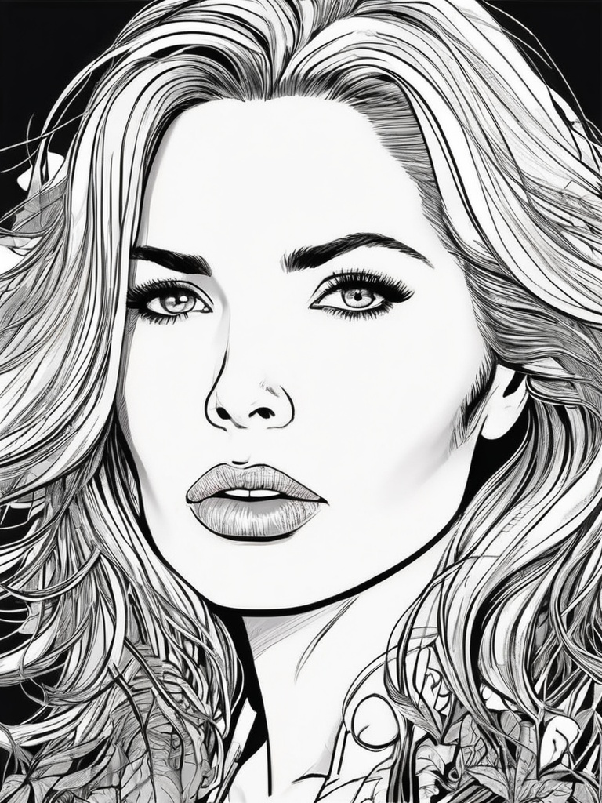
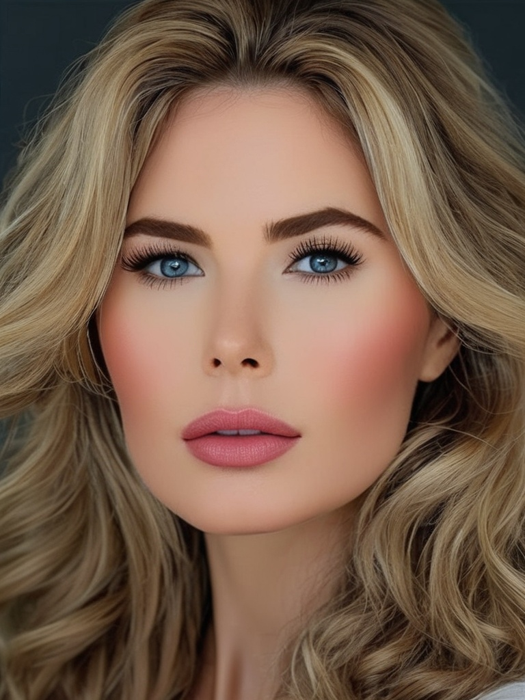
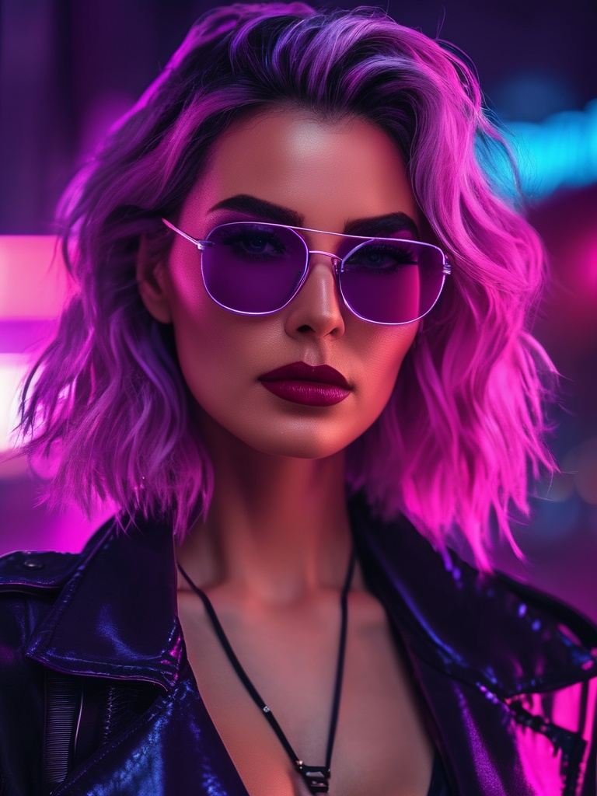

# Styles

Prompt style attribute allow to easily generate an image according to a preconfigured set of styles. The styles are essentially a set of weights that are applied to the model during the generation process.

<figcaption>Animated</figcaption>

<figcaption>Comic book</figcaption>

<figcaption>Line art</figcaption>

<figcaption>Enhance</figcaption>

<figcaption>Fantasy art</figcaption>

<figcaption>Lowpoly</figcaption>

<figcaption>Neonpunk</figcaption>

<figcaption>Photographic</figcaption>

## Usage

Styles can be used in the GUI style dropdown or in the [API](/docs/api/prompt/create/#backend_version-optional) using the `style` attribute. When using a style template, provide a short prompt text describing the main subject and scene, while leaving the generic style keywords to the template.
