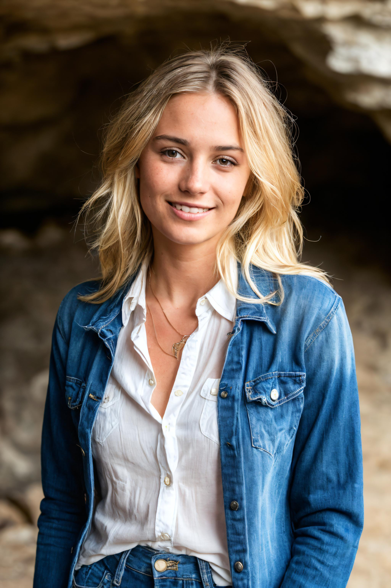
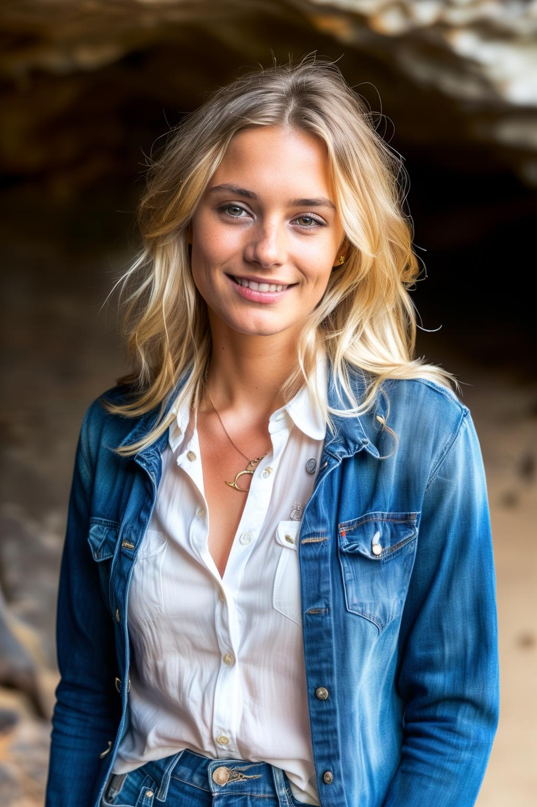
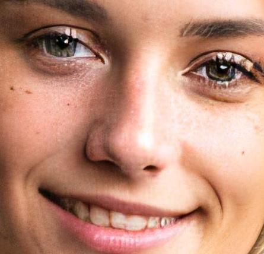
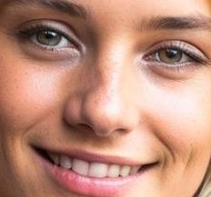

# Tiled upscale
**BETA**

<div style={{ display: "grid", 'grid-template-columns': '1fr 1fr 1fr', gap: '1.5rem' }}>
<div>
<figcaption>Super-Resolution</figcaption>


</div>
<div>
<figcaption>HiRes fix</figcaption>


</div>
<div>
<figcaption>Tiled upscale</figcaption>


</div>
</div>

<div style={{ display: "grid", 'grid-template-columns': '1fr 1fr 1fr', gap: '1.5rem' }}>
<div>
<figcaption>Super-Resolution</figcaption>


</div>
<div>
<figcaption>HiRes fix</figcaption>


</div>
<div>
<figcaption>Tiled upscale</figcaption>


</div>
</div>

See example prompts in the [gallery](https://astria.ai/gallery?text=tiled_upscale).

## Overview
Tiled upscale iterate over the image and upscale each tile individually. This allows to preserve the original training resolution of the image thus allowing sharper and better details.
See example prompts in the [gallery](https://www.astria.ai/gallery?text=tiled_upscale)

To enable tiled upscale, add `--tiled_upscale` to the prompt text.

See [pricing](https://www.astria.ai/pricing) for the cost of this feature.

Example prompt for tiled upscale for the above images:
```text
photograph of a woman, (smiling facial expression:1.1), textured skin, goosebumps, (blonde hair:1.2), (unbuttoned white shirt:1.2), distressed boyfriend jeans, long sleeves, (candlelight,chiaroscuro:1.1), cowboy shot, dark and mysterious cave with unique rock formations and hidden wonders, perfect eyes, Porta 160 color, shot on ARRI ALEXA 65, bokeh, sharp focus on subject, shot by Don McCullin --tiled_upscale
num_images=2
negative_prompt=nude, nsfw, (CyberRealistic_Negative-neg:0.8), (deformed iris, deformed pupils, semi-realistic, cgi, 3d, render, sketch, cartoon, drawing, anime, mutated hands and fingers:1.4), (deformed, distorted, disfigured:1.3), poorly drawn, bad anatomy, wrong anatomy, extra limb, missing limb, floating limbs, disconnected limbs, mutation, mutated, ugly, disgusting, amputation
seed=43
steps=30
cfg_scale=
controlnet=
input_image_url=
mask_image_url=
denoising_strength=
controlnet_conditioning_scale=
controlnet_txt2img=false
super_resolution=true
inpaint_faces=false
face_correct=false
film_grain=false
face_swap=false
hires_fix=false
ar=1:1
scheduler=dpm++sde_karras
color_grading=
use_lpw=true
w=512
h=768
```
