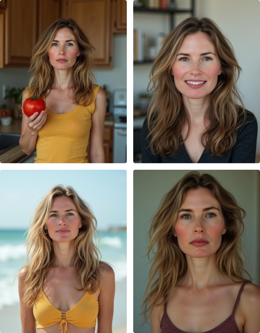

import podcastSrc from './Astria - AI headshots.m4a';

# AI Photoshoot

<audio controls src={podcastSrc} alt="AI Photoshoot podcast - Generative image model finetuning" />
  

## Overview

The term "AI Photoshoot", "AI Headshots" or "AI Avatars" refers to the process of creating a generative AI model from around 16 images of a person. This model can then be used to create professional photography imagery of the person, without requiring high-end camera equipment, lighting, or wardrobe.

AI headshots are particularly useful for social profile photos, such as those used on LinkedIn or Facebook, as well as on dating sites.

Another recent trend is the creation of virtual social influencers - consistent characters that do not exist in reality, but can be generated consistently in different scenes and everyday life.

<figcaption>Training images</figcaption>

<figcaption>Output images</figcaption>

## Steps

### 1. Create a model

At this stage, we will create a 2GB numeric (AI) model file that contains the "features" of a person. This is not the part where we generate new images, but only train a dedicated AI model.

To begin, go to the [New tune](https://www.astria.ai/tunes/new) page.

**Title** - Enter the person's name, e.g. `Elon Musk`. Or choose whatever title that fits your needs. Choosing a title is not a part of the actual training of the model.

**Class Name** - Enter `man` or `woman`, or possibly `boy, girl, cat`, or `dog`. This is highly important as it is a part of the actual technical training of your model. We automatically generate images of the "class" while training, and by comparing them to your images (the training set), the model 'learns' your subject's unique features.

**Base tune** - Select a baseline model on which you would like to train. For best quality we recommend using [Flux1.dev](https://www.astria.ai/gallery/tunes/1504944/prompts). 

Other settings are optional and can be changed to your preference.

### 2. Generate images

Even before the model is ready, you can prepare a queue of prompts (texts) that will be fed into the model and used to generate models.

## Tips for training images

1. Upload both portrait and full body shots of the person
2. Use 26 pictures of your subject. Preferably cropped to 1:1 aspect ratio.
3. Use 6 photos of full body or entire object + 10 medium shot photos from the chest up + 10 close-ups.
4. Variation is key - Change body pose for every picture, use pictures from different days backgrounds and lighting. Every picture of your subject should introduce new info about your subject.
5. Avoid pictures taken at the same hour/day. For example few pictures with the same shirt will make the model learn the shirt as well as part of the subject.
6. Always pick a new background.
2. Do not upload pictures mixed with other people
3. Do not upload upload funny faces

## Tips for inference

1. Use `ohwx woman/man` at the *beginning* of the sentence.
2. Textual inversion can reduce similarity. Try to avoid it. Specifically TIs such as `ng_deepnegative_v1_75t` or `CyberRealistic`.
3. Use of [LoRA](/docs/features/lora) for styles can reduce similarity. Keep LoRA strength low around 0.2-0.3.
