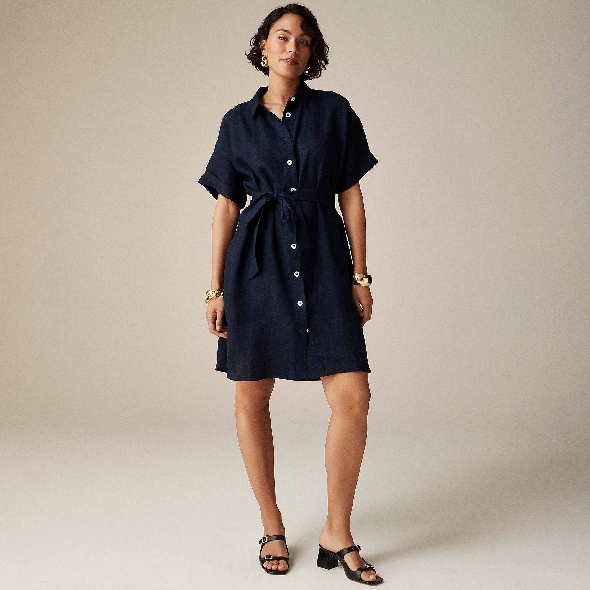
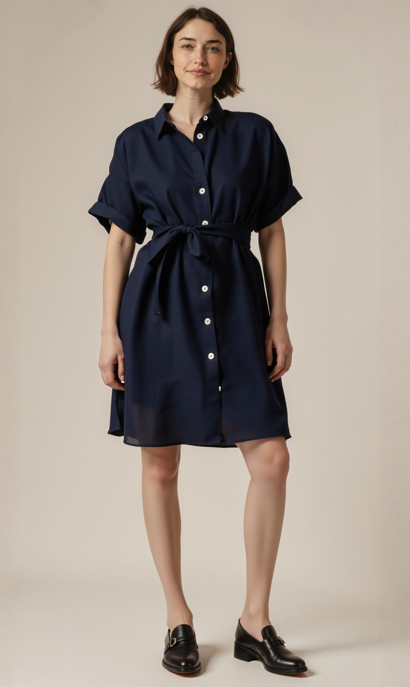
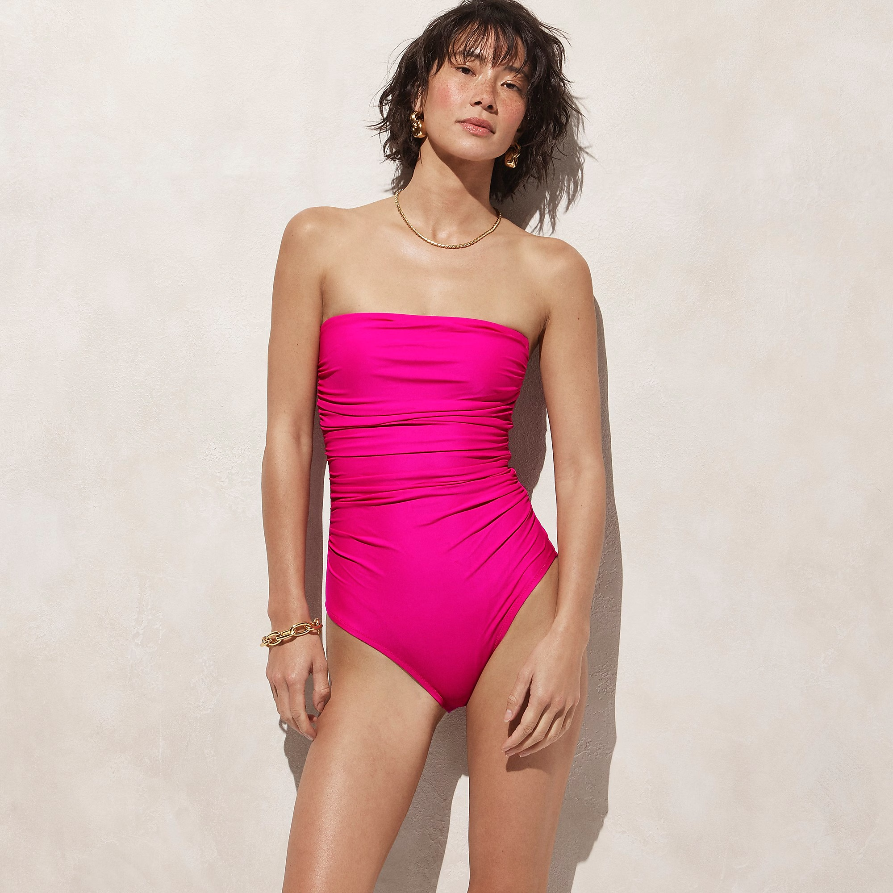
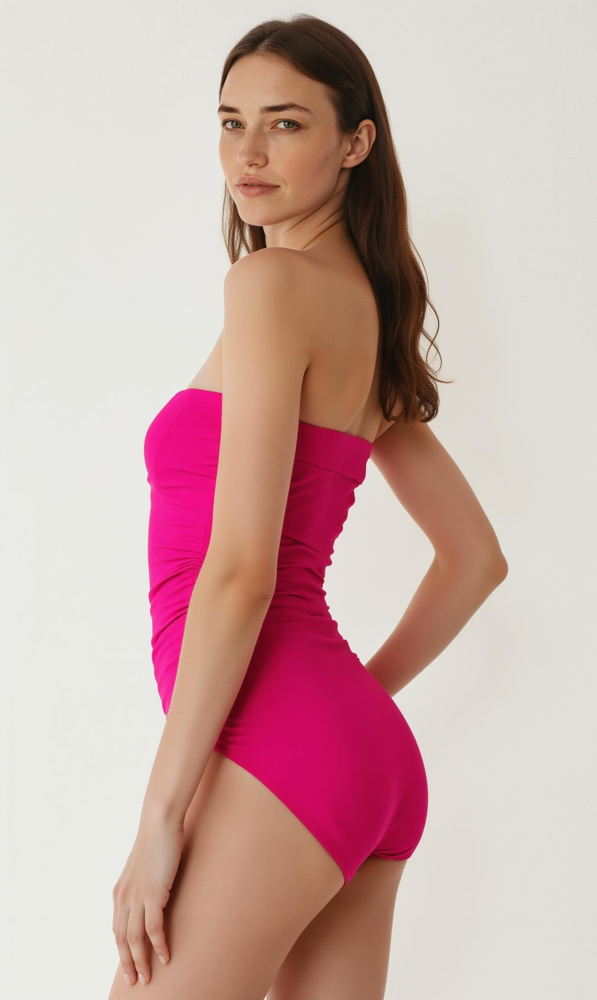
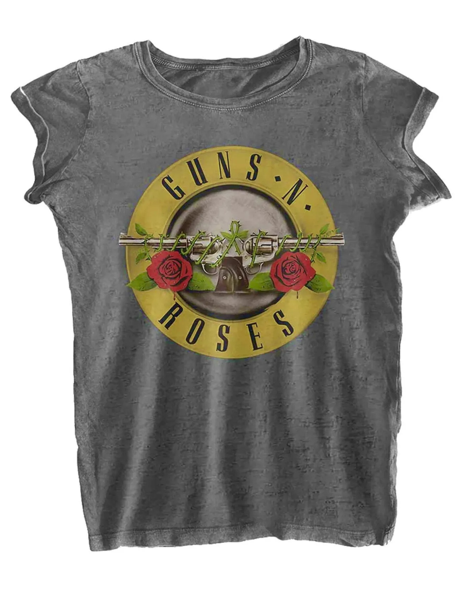
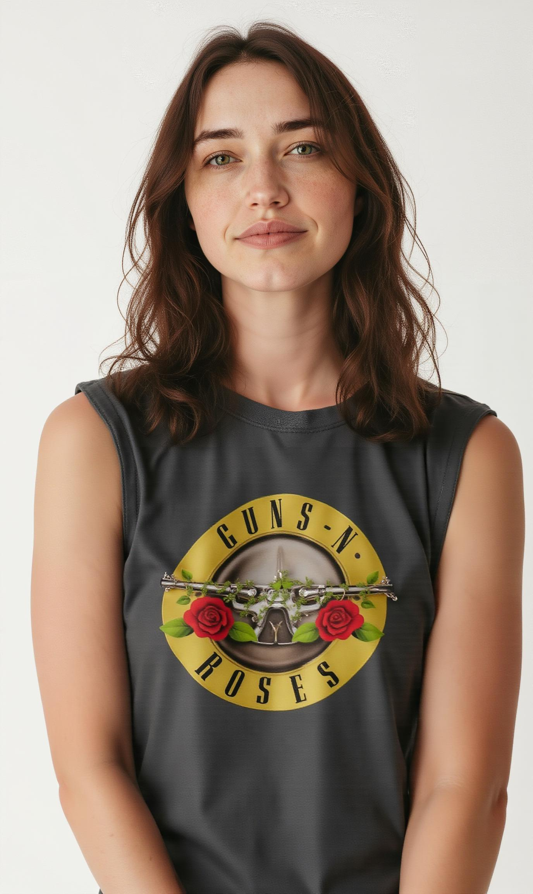

# Virtual Try-on for Flux
**BETA. Flux + Backend V0 only feature.**

<div style={{ display: "grid", 'grid-template-columns': '1fr 1fr', gap: '1.5rem' }}>

<div>

<figcaption>Garment / Clothing - with a model - Recommended</figcaption>


</div>

<div>
<figcaption>Generated images</figcaption>


</div>
</div>

<div style={{ display: "grid", 'grid-template-columns': '1fr 1fr', gap: '1.5rem' }}>

<div>

<figcaption>Garment / Clothing - with a model - Recommended</figcaption>


</div>

<div>
<figcaption>Generated images</figcaption>


</div>
</div>

<div style={{ display: "grid", 'grid-template-columns': '1fr 1fr', gap: '1.5rem' }}>

<div>

<figcaption>Garment / Clothing - Flat lay - must indicate "flat lay" in title - not recommended</figcaption>


</div>

<div>
<figcaption>Generated images</figcaption>


</div>
</div>

More examples in the [gallery](https://www.astria.ai/gallery?text=faceid&branch=flux1)

## Overview

Virtual try-on is the term for the process of generating images of a person wearing a specific garment or clothing item. This can be useful for e-commerce websites, fashion designers, or even for personal use.

See [pricing](https://www.astria.ai/pricing) for the cost of this feature.

## Usage
To use Astria's virtual try-on feature, you need to create:

1. A [faceid](/docs/features/faceid) fine-tune of the garment you want to try on. The faceid class name should be `clothing`, `shirt` or `pants`, `coat` or `swimming suit`. Class name  is used to identify the garment in the image and remove the original model in case a reference image with a fashion model is used.
1. Optional: A model of the person you want to dress up ideally through [fine-tuning](/docs/use-cases/flux-finetuning/)

## Garment reference image
When creating a `faceid` of the garment, two types of images are possible for use:
1. Reference image with a human model. This is recommended as it allows the virtual try-on AI model to infer relative position to the body and get a better understanding of the garment.
2. Flat lay image - a plain image of the garment. In this case, image title must include the wording `flat lay` in the faceid tune description.

## Tips for inference

1. To reference the garment use the `<faceid:xxxxxx:1>` syntax, where `xxxxxx` is the faceid of the garment.
2. If a face of a specific model is desired, use a fine-tuned [LoRA fine-tuned]((/docs/use-cases/flux-finetuning/).
1. Use a short prompt to describe the background, pose and composition. For example `woman wearing a black shirt and jeans, fashion editorial plain white background`.
2. In case a reference image to the garment includes a fashion model, a better alternative to this, could be to use the input image as a reference pose as well as img2img to bring some of the background features into the image. See above example for dress and respective prompt below.
3. Use 9:16 aspect-ratio i.e: 768x1280 width x height for generating the image.
4. Use controlnet pose, preferably preprocessed stick figure. Set `controlnet conditioning scale` to a low 0.3-0.5 and
5. Turn on super resolution, super resolution details and inpaint faces for better results.
6. Avoid occlusions covering the garment in the generated image such as hands or a bag - The garment should be clearly visible.

It is recommended to use 9:16 aspect-ratio - `512x680` width x height for the input image.


Dress example prompt:
````text
<lora:1533312:1.0>  <faceid:1350339:1> front view of ohwx woman wearing dress, fashion editorial plain, white background --control_guidance_end 0.5
num_images=1
negative_prompt=
seed=
steps=
cfg_scale=
controlnet=pose
input_image_url=https://sdbooth2-production.s3.amazonaws.com/lttvv8rz1olcf28cah48igiydwqi
mask_image_url=
denoising_strength=
controlnet_conditioning_scale=0.5
controlnet_txt2img=false
super_resolution=true
inpaint_faces=true
face_correct=false
film_grain=false
face_swap=false
hires_fix=true
backend_version=0
ar=1:1
scheduler=dpm++2m_karras
color_grading=
use_lpw=true
w=768
h=1280
````

Guns and roses flat lay t-shirt example prompt:
````text
<lora:1533312:1.0>  <faceid:1823239:1.0> closeup view of ohwx woman wearing Guns And Roses shirt, fashion editorial plain, white background --control_guidance_end 0.5
num_images=1
negative_prompt=
seed=
steps=
cfg_scale=
controlnet=
input_image_url=
mask_image_url=
denoising_strength=
controlnet_conditioning_scale=0.5
controlnet_txt2img=true
super_resolution=true
inpaint_faces=true
face_correct=false
film_grain=false
face_swap=false
hires_fix=true
backend_version=0
ar=1:1
scheduler=dpm++2m_karras
color_grading=
use_lpw=true
w=768
h=1280
````
