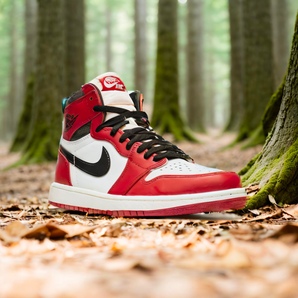

# Product shots

<figcaption>Input image</figcaption>

<figcaption>Mask</figcaption>

<figcaption>Output</figcaption>

<figcaption>Input image</figcaption>

<figcaption>Mask</figcaption>

<figcaption>Output</figcaption>

