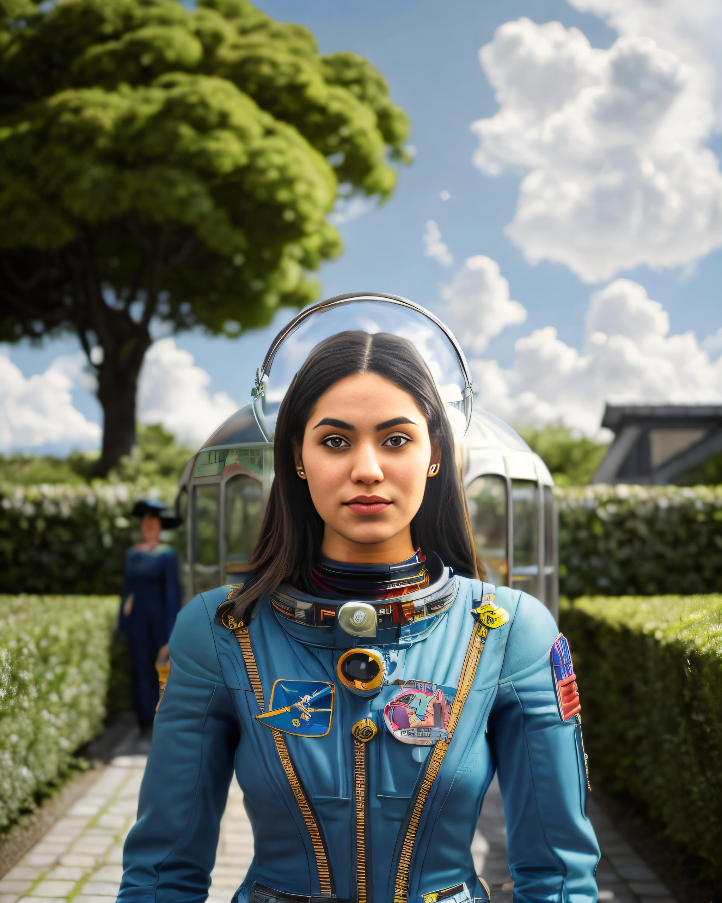
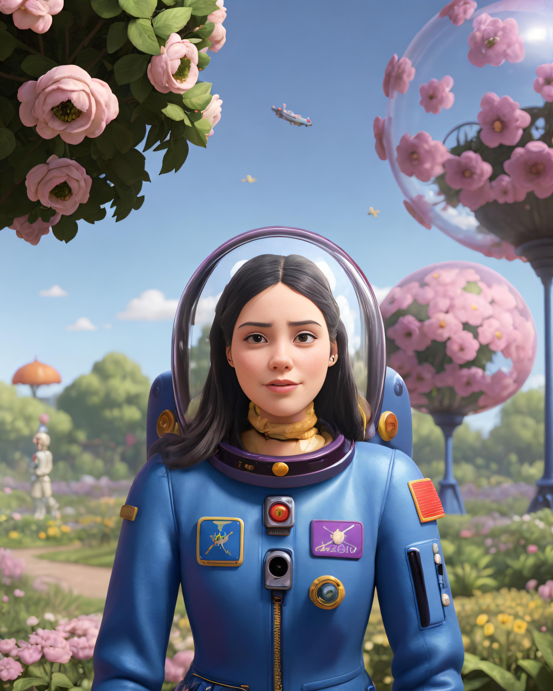
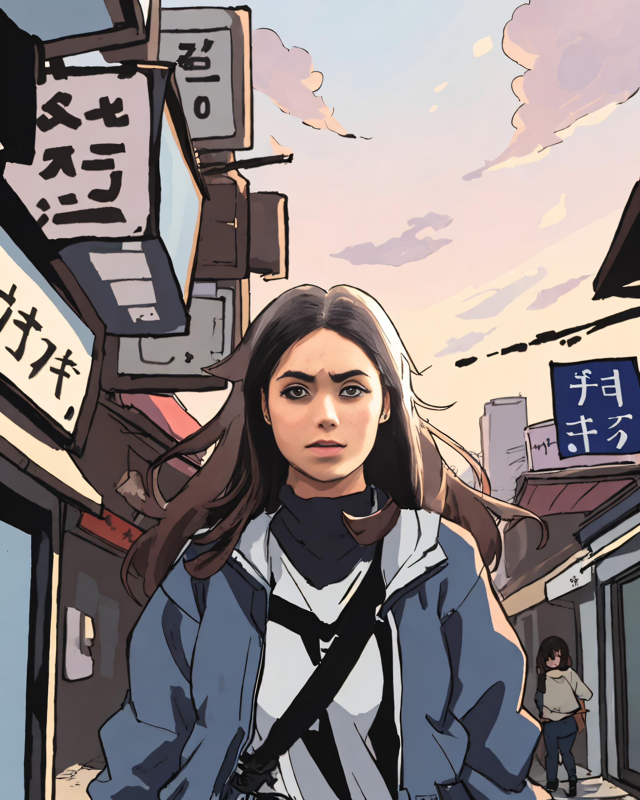
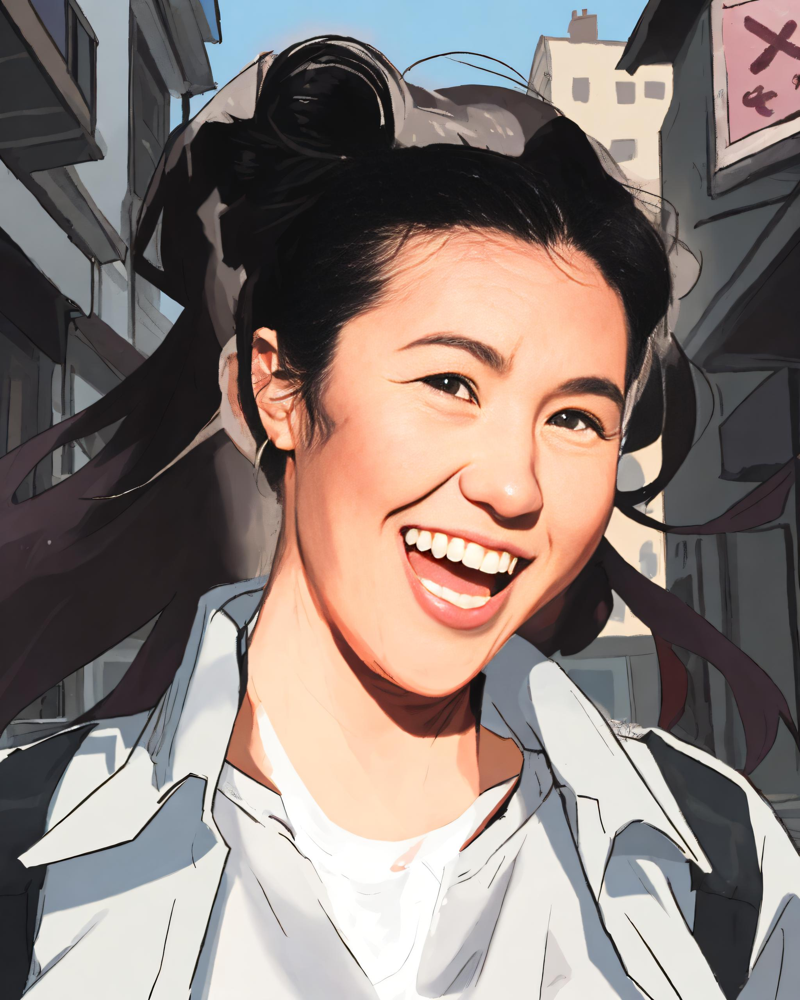
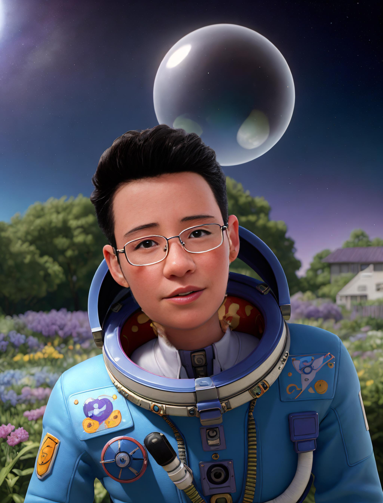

# Masked portraits
**BETA**

<div style={{ display: "grid", 'grid-template-columns': '1fr 1fr 1fr 1fr', gap: '1.5rem' }}>
<div>
<figcaption>Input image</figcaption>


</div>

<div>
<figcaption>Result using <a href="https://www.astria.ai/gallery/tunes/690204/prompts">RV v5.1</a></figcaption>


</div>

<div>
<figcaption>using <a href="https://www.astria.ai/gallery/tunes/636337/prompts">Cartoon</a></figcaption>


</div>

<div>
<figcaption>Using <a href="https://www.astria.ai/gallery/tunes/623021/prompts">Flat</a></figcaption>


</div>

</div>

<div style={{ display: "grid", 'grid-template-columns': '1fr 1fr 1fr 1fr', gap: '1.5rem' }}>
<div>
<figcaption>Input image</figcaption>


</div>

<div>
<figcaption>Result using <a href="https://www.astria.ai/gallery/tunes/690204/prompts">RV v5.1</a></figcaption>


</div>

<div>
<figcaption>using <a href="https://www.astria.ai/gallery/tunes/636337/prompts">Cartoon</a></figcaption>


</div>

<div>
<figcaption>Using <a href="https://www.astria.ai/gallery/tunes/623021/prompts">Flat</a></figcaption>


</div>

</div>

<div style={{ display: "grid", 'grid-template-columns': '1fr 1fr 1fr 1fr', gap: '1.5rem' }}>
<div>
<figcaption>Input image</figcaption>


</div>

<div>
<figcaption>Result using <a href="https://www.astria.ai/gallery/tunes/690204/prompts">RV v5.1</a></figcaption>


</div>

<div>
<figcaption>using <a href="https://www.astria.ai/gallery/tunes/636337/prompts">Cartoon</a></figcaption>


</div>

<div>
<figcaption>Using <a href="https://www.astria.ai/gallery/tunes/623021/prompts">Flat</a></figcaption>


</div>

</div>

<div style={{ display: "grid", 'grid-template-columns': '1fr 1fr 1fr 1fr', gap: '1.5rem' }}>
<div>
<figcaption>Input image</figcaption>


</div>

<div>
<figcaption>Result using <a href="https://www.astria.ai/gallery/tunes/690204/prompts">RV v5.1</a></figcaption>


</div>

<div>
<figcaption>using <a href="https://www.astria.ai/gallery/tunes/636337/prompts">Cartoon</a></figcaption>


</div>

<div>
<figcaption>Using <a href="https://www.astria.ai/gallery/tunes/623021/prompts">Flat</a></figcaption>


</div>

</div>

See example prompts in the [gallery](https://www.astria.ai/gallery?text=mask_prompt).

## Overview

Use [prompt masking](/docs/features/prompt-masking) feature to embed a person into a scene.
This essentially allows you to create AI photogarphy or avatars without fine-tuning.

See [pricing](https://www.astria.ai/pricing) for the cost of this feature.


## Example prompt

```text
realistic digital painting, astronaut in a garden on a spring day, by martine johanna and simon stalenhag and chie yoshii and casey weldon and wlop, ornate, dynamic, particulate, rich colors, intricate, elegant, highly detailed, harpers bazaar art, fashion magazine, smooth, sharp focus, 8 k, octane rende --mask_prompt foreground --mask_negative clothes --mask_invert --mask_dilate -20 --hires_denoising_strength 0.2
num_images=1
negative_prompt=clay, text, watermark, padding, cropped, typography
seed=
steps=30
cfg_scale=
controlnet=pose
input_image_url=https://sdbooth2-production.s3.amazonaws.com/d6ff3soq5pok5tlbcanf599vkw06
mask_image_url=
denoising_strength=
controlnet_conditioning_scale=
controlnet_txt2img=false
super_resolution=true
inpaint_faces=false
face_correct=true
film_grain=false
face_swap=false
hires_fix=true
prompt_expansion=false
ar=1:1
scheduler=dpm++sde_karras
color_grading=
use_lpw=true
w=
h=
```
