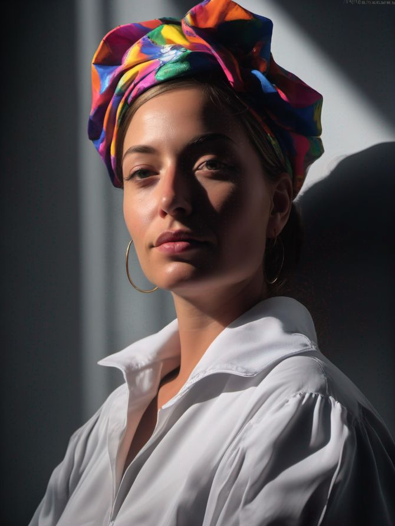

# SDXL training
## Overview

**Stable Diffusion XL** or **SDXL** is the latest image generation model that is tailored towards more photorealistic outputs with more detailed imagery and composition. SDXL can generate realistic faces, legible text within the images, and better image composition, all while using shorter and simpler prompts.

:::info

`LoRA + Text-embedding` is currently the only option for fine-tuning SDXL.

:::

Input training images

Output images

## Training tips

1. Default token for SDXL should be `ohwx` and will be set automatically if none is specified
2. Training resolution is - make sure training images are at least 1024x1024px

## Inference tips

1. Activate face-inpainting (which in turn requires super-resolution) - this is the biggest boost you can get to increase similarity to subject
2. Use `euler_a` scheduler
3. Do not copy and paste prompts from SD15
4. Use clean small concise prompts - usually up to 15 words
5. Avoid long negatives.
6. Do not use textual-inversions such as `easynegative` or `badhands` from SD15
7. Start with baseline SDXL 1.0 inference before going to other base models. Most custom SDXL Civit model available are very biased and may reduce similarity. Models which we noticed that work okay are `ZavyChromaXL` and `ClearChromaXL`

All above tips will help increase similarity to the original subject.

## API tips

1. Unlike SD15 checkpoint training, SDXL on Astria is trained as a LoRa+text-embedding. As such, inference is taking place a on a base line model such as SDXL 1.0 and `prompt.text` should specify the loaded lora such as `<lora:123456:0.83>` - will load lora with id=123456 and strength=0.83
2. Inference API can call ``POST [https://api.astria.ai/prompts](https://www.astria.ai/prompts)` with `tune_id=666678`or [`https://api.astria.ai/tunes/666678/prompts`](https://www.astria.ai/prompts)
3. See [LoRa docs](/docs/feautres/lora) on lora syntax
4. Note that you cannot combine or load multiple LoRa+Text-embedding in one prompt, unlike regular LoRa
