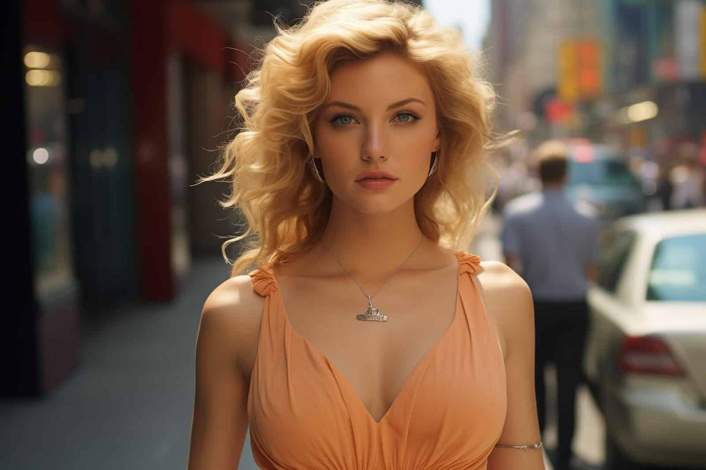

import useBaseUrl from '@docusaurus/useBaseUrl';
import upscaleInput from './img/upscale/upscale-input.jpg';
import upscaleResult from './img/upscale/upscale-result.jpg';
import upscaleLennaInput from './img/upscale/upscale-lenna-in.png';
import upscaleLennaOut from './img/upscale/upscale-lenna-out.jpeg';
import upscaleLennaOut2 from './img/upscale/upscale-lenna-out2.jpg';


# Upscale

<div style={{ display: "grid", 'grid-template-columns': '1fr 1fr', gap: '1.5rem' }}>
<div>
<figcaption>Low-res input</figcaption>


</div>

<div>
<figcaption>
<a href="https://www.astria.ai/gallery?text=only_upscale">Upscaled result</a>
</figcaption>


</div>

</div>

<div style={{ display: "grid", 'grid-template-columns': '1fr 1fr', gap: '1.5rem' }}>
<div>
<figcaption>Low-res input</figcaption>

<div style={{backgroundImage: `url(`+upscaleInput+`)`, backgroundPosition: '50% 20%', backgroundSize: 3000,  width: "100%", height: 300}}></div>
</div>

<div>
<figcaption>
<a href="https://www.astria.ai/gallery?text=only_upscale">Upscaled result</a>
</figcaption>

<div style={{backgroundImage: `url('`+upscaleResult+`')`, backgroundPosition: '50% 20%', backgroundSize: 3000,  width: "100%", height: 300}}></div>
</div>

</div>
<div style={{ display: "grid", 'grid-template-columns': '1fr 1fr', gap: '1.5rem' }}>
<div>
<figcaption>Low-res input</figcaption>


</div>

<div>
<figcaption>
<a href="https://www.astria.ai/gallery?text=only_upscale">Upscaled result</a>
</figcaption>


</div>

</div>

<div style={{ display: "grid", 'grid-template-columns': '1fr 1fr', gap: '1.5rem' }}>
<div>
<figcaption>Low-res input</figcaption>

<div style={{backgroundImage: `url(`+upscaleLennaInput+`)`, backgroundPosition: '50% 20%', backgroundSize: 1000,  width: "100%", height: 300}}></div>
</div>

<div>
<figcaption>
<a href="https://www.astria.ai/gallery?text=only_upscale">Upscaled result</a>
</figcaption>

<div style={{backgroundImage: `url('`+upscaleLennaOut2+`')`, backgroundPosition: '50% 20%', backgroundSize: 1000,  width: "100%", height: 300}}></div>
</div>

</div>


<div className="api-method">
<div>


See example prompts in the [gallery](https://www.astria.ai/gallery?text=only_upscale). Also check out [free upscaling tool page](https://www.astria.ai/upscale).

## Overview
Upscaling uses model and text guidance to add details to original image. Depending on the `denoising_strength` the model can hallucinate more details shifting away from the original image. For applying tiled upscaling straight after image generation see [tiled upscaling](/docs/features/tiled-upscale). 

## Usage
1. In the [prompts](https://www.astria.ai/prompts) generate page - Set an input image in the Controlnet/img2img section.
2. Add a text prompt ending with `--only_upscale`
3. Select a model from the dropdown that matches the style and content of the input image.

## Example 
Example prompt for the result above

```text
masterpiece, best quality, highres, <lora:more_details:0.5> <lora:SDXLrender_v2.0:1> --only_upscale
num_images=1
negative_prompt=(worst quality, low quality, normal quality:2) JuggernautNegative-neg
seed=
steps=16
cfg_scale=6.0
controlnet=
input_image_url=https://sdbooth2-production.s3.amazonaws.com/cvrx6g5wx5tbiuz9ivoah1j19why
mask_image_url=
denoising_strength=0.1
controlnet_conditioning_scale=
controlnet_txt2img=false
super_resolution=false
inpaint_faces=false
face_correct=false
film_grain=false
face_swap=false
hires_fix=false
backend_version=1
prompt_expansion=undefined
ar=1:1
scheduler=euler_a
color_grading=
use_lpw=false
w=
h=
```

</div>

<div>


#### POST /tunes/:id/prompts

<Tabs groupId="lang">
  <TabItem value="curl" label="cURL" default>

```bash showLineNumbers
# Note the hard-coded 690204 which is the tune_id of Realistic Vision v5.1 from the gallery
curl -X POST -H "Authorization: Bearer $API_KEY" https://api.astria.ai/tunes/690204/prompts \
          -F prompt[text]=very detailed, masterpiece, intricate details, UHD, 8K --only_upscale <lora:add_detail:1>" \
          -F prompt[negative_prompt]="lowres, medium quality, lack of details, bad quality, worst quality, blur, blurry, pixelated, jpeg artifacts" \
          -F prompt[callback]="https://optional-callback-url.com/to-your-service-when-ready?prompt_id=1" 
```
  </TabItem>
  <TabItem value="javascript" label="Node.js">

```javascript
const fetch = require('node-fetch');
const FormData = require('form-data');

// Note the hard-coded 690204 which is the tune_id of Realistic Vision v5.1 from the gallery
const API_URL = 'https://api.astria.ai/tunes/690204/prompts';
const API_KEY = 'YOUR_API_KEY'; // Replace with your actual API key
const headers = { Authorization: `Bearer ${API_KEY}` }

const form = new FormData();
form.append('prompt[text]', 'very detailed, masterpiece, intricate details, UHD, 8K --only_upscale <lora:add_detail:1>');
form.append('prompt[negative_prompt]', 'lowres, medium quality, lack of details, bad quality, worst quality, blur, blurry, pixelated, jpeg artifacts');
form.append('prompt[callback]', 'https://optional-callback-url.com/to-your-service-when-ready?prompt_id=1');

fetch(API_URL, {
  method: 'POST',
  headers: headers,
  body: form
}).then(response => response.json())


```
  </TabItem>
  <TabItem value="python" label="Python">

```python
import requests

# Note the hard-coded 690204 which is the tune_id of Realistic Vision v5.1 from the gallery
API_URL = 'https://api.astria.ai/tunes/690204/prompts'
API_KEY = 'YOUR_API_KEY'  # Replace with your actual API key

headers = {
    'Authorization': f'Bearer {API_KEY}'
}

data = {
  'prompt[text]': 'very detailed, masterpiece, intricate details, UHD, 8K --only_upscale <lora:add_detail:1>',
  'prompt[negative_prompt]': 'lowres, medium quality, lack of details, bad quality, worst quality, blur, blurry, pixelated, jpeg artifacts',
  'prompt[callback]': 'https://optional-callback-url.com/to-your-service-when-ready?prompt_id=1'
}
files = []
files.append((f"tune[prompts_attributes][{i}][input_image]", load_image(prompt['input_image'])))


response = requests.post(API_URL, headers=headers, data=data)
```
  </TabItem>
</Tabs>

</div>
</div>
